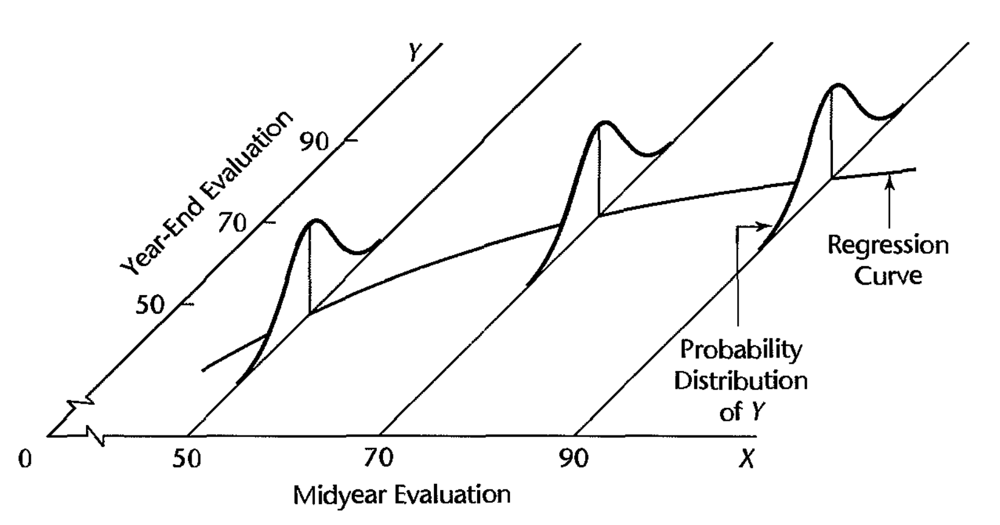

<script src="https://ajax.googleapis.com/ajax/libs/jquery/1.12.2/jquery.min.js"></script>

<script>
    $(document).ready(function() {
    $('slide:not(.title-slide, .backdrop, .segue)').append('<footer></footer>');    
    $('footer').attr('url', "https://math5387.web.app");

  })
</script>


<style>
pre {
    display: block;
    font-family: monospace;
    white-space: pre;
    margin: 1em 0px;
    margin-top: 0em;
    margin-right: 0px;
    margin-bottom: -0.2em;
    margin-left: 0px;
}
footer:after {
    font-size: 12pt;
    content: attr(url);
    position: absolute;
    bottom: 5px;
    right: 60px;
    line-height: 1.9;
    display: block;
  }
slides > slide {
  font-family: 'Open Sans', Arial, sans-serif;
  font-size: 26px;
  color: black;
  width: 900px;
  height: 700px;
  margin-left: -450px;
  margin-top: -350px;
  padding: 0px 60px;
  -webkit-border-radius: 5px;
  -moz-border-radius: 5px;
  -ms-border-radius: 5px;
  -o-border-radius: 5px;
  border-radius: 5px;
  -webkit-transition: all 0.6s ease-in-out;
  -moz-transition: all 0.6s ease-in-out;
  -o-transition: all 0.6s ease-in-out;
  transition: all 0.6s ease-in-out;
}
slides > slide > hgroup + article {
  margin-top: 5px;
}
</style>

```{r setup, include=FALSE}
knitr::opts_chunk$set(fig.align = 'center', echo = F, message = F)
```

## What we need to check?

* Nonlinearity of regression function
* Nonconstancy of error variance
* Nonindependence of error terms
* Nonnromality of error terms
* Presence of outliers and influencial observations


# Residual Plots

## Importance

* Diagnostic plots of the response variable are not very useful
* Residual plots usually (indirectly) carries out diagnostics of the response variable
* Residuals gives us information about model structure and the nature of unobserved randomness. 

## Different plots of residuals

* Plots of residuals against predictor variables
* Plot of residuals against fitted values
* Plot of absolute or squared residuals against fitted values or predictor variables 
* Plot of residuals against time or other sequence
* Plots of residuals against omited predictor variables
* Box plot and density plot of residuals
* Q-Q plot of residuals

## Reminder 

```{r}

```


## Simulated scenarios 

```{r}
par(mfrow = c(2,2))
x = seq(-5,5)
y1 = rep(-0.5, length(x))
y2 = rep(0.5, length(x))
plot(x, y1, ylim = c(-1.5,1.5), type = 'l',xaxt='n', yaxt='n', xlab = '(a)', ylab = 'Residuals', col = 'skyblue')
lines(x,y2, col = 'skyblue')
polygon(c(x,rev(x)), c(y2, rev(y1)), col = 'skyblue', border = F)
abline(h=0, col = 'red')
axis(side =2, c(0), labels = T)

x = seq(-10,10)
y2 = 2.25-0.03*x^2
y1 = 0.25-0.03*x^2
plot(x, y1, ylim = c(-3,3), type = 'l',xaxt='n', yaxt='n', xlab = '(b)', ylab = 'Residuals', col = 'skyblue')
lines(x,y2, col = 'skyblue')
polygon(c(x,rev(x)), c(y2, rev(y1)), col = 'skyblue', border = F)
abline(h=0, col = 'red')
axis(side =2, c(0), labels = T)

x = seq(0,10)
y2 = 1 + 0.7*x
y1 = -1-0.7*x
plot(x, y1, ylim = c(-15,15), type = 'l',xaxt='n', yaxt='n', xlab = '(c)', ylab = 'Residuals', col = 'skyblue')
lines(x,y2, col = 'skyblue')
polygon(c(x,rev(x)), c(y2, rev(y1)), col = 'skyblue', border = F)
abline(h=0, col = 'red')
axis(side =2, c(0), labels = T)

x = seq(-10,10)
y2 = 4 + 0.7*x
y1 = -4+0.7*x
plot(x, y1, ylim = c(-15,15), type = 'l',xaxt='n', yaxt='n', xlab = '(d)', ylab = 'Residuals', col = 'skyblue')
lines(x,y2, col = 'skyblue')
polygon(c(x,rev(x)), c(y2, rev(y1)), col = 'skyblue', border = F)
abline(h=0, col = 'red')
axis(side =2, c(0), labels = T)
```

## Example (Non-constant error variance)

```{r}
par(mfrow = c(1,2))
bp = read.table('./data/blood_pressure.dat', header = T)
lmod = lm(BP ~ Age, data = bp)
plot(bp$Age, lmod$residuals, xlab = 'Age', ylab = 'Residuals', pch = 19)
abline(h=0, col = 'red')
x = seq(15,60,20)
y2 = x*0.35
y1 = - x*0.35
polygon(c(x,rev(x)), c(y2, rev(y1)), col=rgb(1, 0, 0,0.1), border = F)
plot(bp$Age, abs(lmod$residuals), xlab = 'Age', ylab = 'Absolute residuals', pch = 19, xlim = c(10,65))
y1 = rep(0,length(x))
polygon(c(x,rev(x)), c(y2, rev(y1)), col=rgb(1, 0, 0,0.1), border = F)
abline(lm(abs(lmod$residuals)~bp$Age), col = 'red')
```

## Test for non-constatnt variance

* If the data is separable in some way then a F test works
* Brown_Forsythe test (a t-test)
* Breusch-Pegan test (also known as Cook-Weisberg score test)
    - It is a chi-squared test


## Residual Plots 

* It can be used to check
    - Nonlinear structure 
    - Non-constant error variance
    - Non-zero error mean
* Though it is not used directly to detect unusual observations but gives us an overview of the observations. 
* Though it indicates potential structural problem it does not clearly suggest transformation because it fails to distinguish between monotonic and non-monotonic transformation. 
* Does not show the nature of the marginal effect of a predictor variable, given the other predictor variables in the model. 

## Interesting Extreme Example

```{r message=F, echo=T}
library(faraway)
set.seed(123)
male = 600
female = 400

bp = c(rnorm(male, 85, 2), rnorm(female, 75, 1))
bmi = c(rnorm(male, 24, 4), rnorm(female, 28, 2))
chol = c(rnorm(male, 200, 10), rnorm(female, 150, 15))
gender = c(rep(1, male), rep(0, female))
dat = data.frame(bp = bp, bmi= bmi ,chol = chol, gender = gender)
lmod = lm(bmi ~ bp + chol, data = dat)
sumary(lmod)

```

## Interesting Extreme Example (Residual Plot)

```{r}
plot(lmod, 3)
```


## What does the residual plot suggests?

```{r}
sumary(lm(bmi ~ bp + chol, data = dat[dat$gender==1,]))
sumary(lm(bmi ~ bp + chol, data = dat[dat$gender==0,]))
```

## Test for non-constatnt variance

* If the data is separable in some way then a F test works
* Brown_Forsythe test (a t-test)
* Breusch-Pegan test (also known as Cook-Weisberg score test)
    - It is a chi-squared test


## Added variable plot

* Gives marginal relationship given the other predictors are in the model
* Can be used to investigate if a new variable is worthy to include in the model 
* Provide clearer picture compared to residual vs predictor plot 


## Simulated Scenarios

```{r}
par(mfrow = c(1,3))
x = seq(-5,5)
y1 = rep(-0.5, length(x))
y2 = rep(0.5, length(x))
plot(x, y1, ylim = c(-1.5,1.5), type = 'l',xaxt='n', yaxt='n', xlab = '(a)', ylab = 'Residuals', col = 'skyblue')
lines(x,y2, col = 'skyblue')
polygon(c(x,rev(x)), c(y2, rev(y1)), col = 'skyblue', border = F)
abline(h=0, col = 'red', lty = 2)
axis(side =2, c(0), labels = T)


x = seq(-10,10)
y2 = 4 + 0.7*x
y1 = -4+0.7*x
plot(x, y1, ylim = c(-15,15), type = 'l',xaxt='n', yaxt='n', xlab = '(d)', ylab = 'Residuals', col = 'skyblue')
lines(x,y2, col = 'skyblue')
polygon(c(x,rev(x)), c(y2, rev(y1)), col = 'skyblue', border = F)
abline(h=0, col = 'red', lty = 2)
abline(a=0, b = 0.7)
axis(side =2, c(0), labels = T)


x = seq(3,23)
x1 = x+3
x2 = x-3
y = sqrt(x) - 3.2
y1 = sqrt(x1)-3.2
y2 = sqrt(x2) - 3.2
plot(x1, y1, ylim = c(-1.5,1.5), type = 'l', xlab = '(b)', ylab = 'Residuals', col = 'skyblue')
lines(x2,y2, col = 'skyblue')
polygon(c(x,rev(x)), c(y2, rev(y1)), col = 'skyblue', border = F)
lines(x,y)
abline(h=0, col = 'red', lty = 2)

```

(a) No additional information from the predictor
(b) Helpful addition of the predictor
(c) Inclusion of the predictor with some transformation.

## AV plot example

```{r}
par(mfrow = c(1,2))
life = read.table('./data/life_insurance.dat', header = T)
lmod = lm(Insurance ~ Income + Risk, data = life)
plot(lmod$residuals ~ life$Income, xlab = 'Income', ylab = 'Residuals')
car::avPlot(lmod, 'Income')
```


## Component plus residual (CR) plot

The **component plus residual (cr) plot**  (a.k.a, **partial residual plot**) is a competitor to the added variable plot.

The **cr plot** shows $\hat{\beta}_i x_i+\hat{\epsilon}$ versus $x_i$.

-	**cr** plots are useful for checking nonlinear relationships in the variable being considered for inclusion in the model.

-	They can also suggest potential transformation of the data so that the relationship is linear.
-	If the scatter plot does not appear to be linear, then there is a nonlinear relationship between the regressor and the response (after accounting for the other regressors).  
-	The slope of the line fit to the cr plot is $\hat{\beta}_i$.


# Unusual observations

## Leverage 

* A **leverage** point is an observation that is unusual in the predictor space.
* $h_{ii}$ is called the leverage value of the $i$  th observation.
* $h_{ii}$ is a measure of distance between the $X$ values for the $i$th observation from the mean of the $X$ values of all $n$ observations. 
* $h_{ii}$ measures the role of the $X$ values in determining how important $y_i$ is in affecting $\hat{y}_i$
* A half-normal plot of the leverage values can be used to identify observations with unusually high leverage.
* A leverage value $h_i$ is usually considered large if it is more than twice as large as the mean leverage value. 


## Example


```{r echo = F, fig.pos='center'}
data(savings, package = 'faraway')
lmod = lm(sr~.,data = savings)
n = nrow(savings)
u = (n+c(1:n))/(2*n+1)
plot(u, sort(hatvalues(lmod)), xlab = 'Half-normal quantile', ylab = 'leverage')
```


## Outlier 

An outlier is a point that does not fit the current model.
	
- An outlier is context specific!  An outlier for one model may not be an outlier for a different model.

externally **studentized** residual

$$t_i = \frac{y_i -\hat{y}_{(i)}}{\hat{\sigma}_{(i)}\sqrt{1+x_i^T\left(X_{(i)}^TX_{(i)} \right)^{-1}x_i}} \sim T_{n-p-1}.$$

* Bonferroni correction is needed


## Example

```{r echo=F, fig.pos='center'}
data(star, package = 'faraway')
lmod_w_outlier = lm(log(light) ~ log(temp), data = star)
plot(log(light) ~ log(temp), data = star)
abline(lmod_w_outlier)
lmod_wo_outlier = lm(log(light) ~ log(temp), data = star[log(star$temp)>1.3, ])
abline(lmod_wo_outlier,lty = 2)
```


## Influential observations

* An influential observation is one whose removal from the dataset would cause a large change in the fitted model.

* An influential observation is usually a leverage point, an outlier, or both.

The Cook’s distance is a popular inferential tool because it reduces influence information to a single value for each observation.

The Cook’s distance for the ith observation is

$$D_i = \frac{(\hat{y} - \hat{y}_{(i)})^T(\hat{y} - \hat{y}_{(i)})}{p\hat{\sigma}^2} = \frac{1}{p}r_i^2\frac{h_i}{1-h_i}$$

## Example

```{r echo=F, fig.pos='center'}
lmod = lm(sr~.,data = savings)
cook <- cooks.distance(lmod)
countries = row.names(savings)
faraway::halfnorm(cook, n = 3, labs = countries, 
         ylab = "Cook's distances")
```

## Influence plot

```{r fig.pos='center'}
car::influencePlot(lmod)
```

## Correct or Delete the Observation(s)

*	If they’re data entry errors, correct the problem.  If they can’t be fixed, remove them (they’re wrong, so they don’t tell us anything useful).
*	Remove them if they’re not part of the population of interest (you are studying dogs, but this observation is a cat).
*	Remove them because they break the model.

  -	This is a bad idea.
*	Make sure to indicate that you removed them from the data set and explain why.

  -	*THIS IS A BAD IDEA.*
  
## Fit a Different Model

-	An outlier/influential point for one model may not be for another.
-	Examine the physical context—why did it happen?
  -	An outlier/influential point may be interesting in itself.
    -	An outlier in a statistical analysis of credit card transactions may indicate fraud!
  -	This may suggest a better model.
-	Use robust regression, which is not as affected by outliers/influential observations.
-	Never automatically remove outliers/influential points!
  -	They provide important information that may otherwise be missed.
-	Fit the model with and without the influential observation(s).
  -	Do your results substantively change?

## Checking Error

Summary of methods for checking error assumptions

* Mean-zero error assumption:
	- Plot of residuals versus fitted values
* Constant error variance assumption:
	- Plot of residuals versus fitted values
	- Plot of √(|ϵ ̂|) versus fitted values.
* Normal error assumption:
	- q-q of residuals
	- Shapiro-wilk test
* Autocorrelated errors:
	- Plot of residuals versus time
	- Plot of successive pairs of residuals
	- Durbin-Watson test

```{r setup1, echo=FALSE, include=F}
knitr::opts_chunk$set(fig.align = 'center', echo = F, message = F)
library(faraway)
library(alr4)
```


# Weighted Least Squares

## Model 

The generalized multiple regression model:

$$Y_i = \beta_0 + \beta_1X_{i1} + \dots + \beta_{p-1}X_{i, p-1} + \epsilon_i$$
where, 

* $\beta_0, \beta_1, \dots , \beta_{p-1}$ are parameters
* $X_{i1}, \dots X_{i, p-1}$ are known constants 
* $\epsilon_i$ are independent $N(0,\sigma_i^2)$

## Variance-covariance matrix 

$$Var(\epsilon) = \begin{bmatrix}\sigma_1^2 & 0 & \dots & 0 \\
0 & \sigma_2^2 & \dots & 0 \\
\vdots & \vdots & & \vdots \\
0 & 0 & \dots & \sigma_n^2\end{bmatrix}$$

* OLS assumes equal variance: $\sigma_1^2 =\dots = \sigma_n^2 = \sigma^2$
* Using OLS we would get unbiased estimation of the parameters
* The OLS estimates no longer have minimum variance 
* We must account for unequal variance in the estimation process
* Consider three cases:
    - Error variances are known (unrealistic)
    - Error variances are known up to proportionality constant 
    - Error variances are known (realistic)
    
## Error variances are known

Likelihood 

$$L(\beta) = \prod\limits_{i=1}^n \frac{1}{\sqrt{2\pi\sigma_i^2}} \exp \left[ -\frac{1}{2\sigma_i^2} (Y_i -\beta_0 - \beta_1X_{i1} -\dots - \beta_{p-1}X_{i, p-1})^2\right]$$

Define $$w_i = \frac{1}{\sigma_i^2}$$

$$L(\beta) = \left[\prod\limits_{i=1}^n \frac{\sqrt{w_i}}{\sqrt{2\pi}}\right] \exp \left[ -\frac{1}{2} \sum\limits_{i=1}^n w_i(Y_i -\beta_0 - \beta_1X_{i1} -\dots - \beta_{p-1}X_{i, p-1})^2\right]$$
Minimize 

$$Q_w = \sum\limits_{i=1}^n w_i(Y_i -\beta_0 - \beta_1X_{i1} -\dots - \beta_{p-1}X_{i, p-1})^2$$
## Intuition 

* $w_i$ for $i=1,\dots , n$ are the regression weights
* In OLS $w_i=1$ i.e. all observations get equal weights
* Weight $w_i$ are inversely proportional to the variance $\sigma_i^2$
* Weights reflects the amount of information contained in the observations
* An observation with higher variance gets smaller weight
* More precise $\Rightarrow$ More information $\Rightarrow$ More weight

## In matrix notation 

$$W = \begin{bmatrix}w_1 & 0 & \dots & 0 \\
0 & w_2 & \dots & 0 \\
\vdots & \vdots & & \vdots \\
0 & 0 & \dots & w_n\end{bmatrix}$$

Normal Equation 

$$(X^TWX)\hat{\beta}_w = X^TWY$$

Estimators

$$\hat{\beta}_w = (X^TWX)^{-1}X^TWY$$

Variance of the estimators 

$$Var(\hat{\beta}_w = (X^TWX)^{-1}$$


## Properties of the estimators

* Unbiased 
* Consistent 
* Minimum variance among unbiased linear estimators
* When weights are known Var($\hat{\beta}_w$) is generally less than Var($\hat{\beta}$)


## Error variances unknown

* We need to estimate the error variances. 
* Residuals from an OLS gives valuable information about the error variances
* Two methods:
    - Estimation of variance function 
    - Use of replicates or near replicates
    
## Estimation of variance 

* Squared residual $\hat{\epsilon}^2$ is an estimator of $\sigma_i^2$
* Absolute residual $|\hat{\epsilon}|$ is an estimator for $\sigma_i$
* Idea 
    - We can estimate the variance function describing the relation of $\sigma_i^2$ to relevant predictor variables by first fitting the regression model using unweighted least squares and then regressing $\hat{\epsilon}^2$ or $|\hat{\epsilon}|$ against the appropriate predictor variables. 
* $|\hat{\epsilon}|$ is preferred if outliers exist. 

## General guidelines

1. A residual plot against $X_l$ exhibits a megaphone shape. $\Rightarrow$  Regress the absolute residuals against $X_l$

2. A residual plot against $\hat{Y}$ exhibits a megaphone shape. $\Rightarrow$  Regress the absolute residuals against $\hat{Y}$
3. A plot of the squared residuals against $X_l$ exhibits an upward tendency. $\Rightarrow$ Regress the squared residuals against $X_l$

3. A plot of the squared residuals against $X_l$ suggests that the variance increases rapidly with increases in $X_l$ up to a point and then increases more slowly. $\Rightarrow$ Regress the absolute residuals against $X_l$ and $X_l^2$. 

## What next?

After the variance function or the standard deviation function is estimated, the fitted values from this function are used to obtain the estimated weights:

$$w_i = \frac{1}{\hat{s}_i^2}\quad \text{ where } \hat{s}_i \text{ is fitted value from standard deviation function}$$
$$w_i = \frac{1}{\hat{v}_i}\quad \text{ where } \hat{v}_i \text{ is fitted value from variance function}$$

The parameters are then estiamted as 

$$\hat{\beta}_w = (X^TWX)^{-1}X^TWY$$

## Use of Replicates or Near Replicates

* In designed experiments $\sigma_i^2$ is estimated suing replicate observations at each combination of levels of the predictor variables. 

* In observation studies, near replicates many be used. 
* For example, if the residual plot against $X_l$ shows a megaphone appearance, cases with $X_1$ values can be grouped together and the variance of the residuals in each group calculated.
    - The reciprocal of these variances are the weights.
    
    
## Example (Strong Interaction ALR4 page 157)

* Response : scattering cross-section ($y$), Predictor: square of total energy in the center of mass frame of reference ($s$)
* Designed experiment 
* A very large number of particles was counted at each setting of $s$
* The variance of $y$ is thus known almost exactly 

## Example (Strong Interaction ALR4 page 157)

```{r}
lmod = lm(y~x, weights = 1/SD^2, data = alr4::physics)
summary(lmod)
```


## Example (Blood pressure)

```{r fig.width=10, fig.height=4}
blood = read.table('./data/blood_pressure.dat', header = T)
lmod = lm(BP ~ Age, data = blood)
par(mfrow = c(1,3))
plot(BP ~ Age, data = blood, main = '(a)')
abline(lmod)
plot(blood$Age, lmod$residuals, xlab = 'Age', ylab = 'Residual', main = '(b)')
abline(h=0)

plot(blood$Age, abs(lmod$residuals), xlab = 'Age', ylab = 'Residual', main = '(c)')
abline(lm(abs(lmod$residuals)~blood$Age))
```

(a) $\Rightarrow$ linear relationship (unweighted)
(b) $\Rightarrow$ confirms the nonconstant error variance 
(c) $\Rightarrow$ a linear relation between Age and standard error is reasonable


## Example (Blood pressure)

* Regress absolute residuals against `Age` 

```{r}
lmod_abs_res = lm(abs(lmod$residuals) ~ blood$Age)
sumary(lmod_abs_res)
```

* Variance function 

$$\hat{s} = `r coef(lmod_abs_res)[1]` + `r coef(lmod_abs_res)[2]` Age$$

* Weights 

```{r echo=T}
w = 1/lmod_abs_res$fitted.values^2
head(w)
head(blood$Age)
```


## Example (Blood pressure)

* OLS

```{r}
sumary(lmod)
```

* WLS

```{r echo=T}
wls_mod = lm(BP ~ Age, weights = w, data = blood)
sumary(wls_mod)
```
