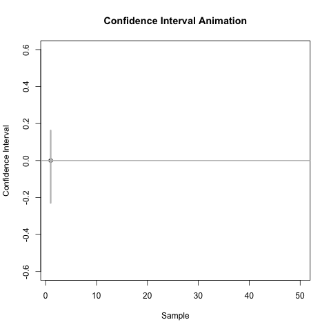

<script src="https://ajax.googleapis.com/ajax/libs/jquery/1.12.2/jquery.min.js"></script>

<script>
    $(document).ready(function() {
    $('slide:not(.title-slide, .backdrop, .segue)').append('<footer></footer>');    
    $('footer').attr('url', "https://math5387.web.app");

  })
</script>


<style>
pre {
    display: block;
    font-family: monospace;
    white-space: pre;
    margin: 1em 0px;
    margin-top: 0em;
    margin-right: 0px;
    margin-bottom: -0.2em;
    margin-left: 0px;
}
footer:after {
    font-size: 12pt;
    content: attr(url);
    position: absolute;
    bottom: 5px;
    right: 60px;
    line-height: 1.9;
    display: block;
  }
slides > slide {
  font-family: 'Open Sans', Arial, sans-serif;
  font-size: 26px;
  color: black;
  width: 900px;
  height: 700px;
  margin-left: -450px;
  margin-top: -350px;
  padding: 0px 60px;
  -webkit-border-radius: 5px;
  -moz-border-radius: 5px;
  -ms-border-radius: 5px;
  -o-border-radius: 5px;
  border-radius: 5px;
  -webkit-transition: all 0.6s ease-in-out;
  -moz-transition: all 0.6s ease-in-out;
  -o-transition: all 0.6s ease-in-out;
  transition: all 0.6s ease-in-out;
}
slides > slide > hgroup + article {
  margin-top: 5px;
}
</style>

```{r setup, include=FALSE}
knitr::opts_chunk$set(fig.align = 'center')
```


# Hypothesis Testing

## Overview

A statistical test of hypotheses is a statistical procedure used to decide between a null hypothesis, H_0, and an alternative hypothesis, H_a or H_1.

-	The **null hypothesis** is usually a hypothesis that nothing interesting is going on.
-	The **alternative hypothesis** is (generally) the complement of the null hypothesis and is usually what we want to show is true. It is also knows as **claim**

## Test Statistic

A test statistic is used to decide between $H_0$ and $H_a$.

-	It’s a function of the data (and possibly the parameters in the hypotheses) that measures the support of the data for the $H_a$.

-	Assuming $H_0$ is true (which is why it is called the null or default hypothesis), we determine the sampling distribution (at least approximately) of the test statistic.

-	We can assess what a typical test statistic would be if $H_0$ is true, and what would be an unusual test statistic.

-	The distribution of the test statistic assuming $H_0$ is true is called the **null distribution**.

## Types of Error

There are two types of errors we can make when doing hypothesis testing:

-	Type I error is rejecting H_0 when H_0 is true.
-	Type II error is failing to reject H_0 when H_a is true.

We can control the Type I error rate at a specified level $\alpha$ (called the significance level) since we know the distribution of the test statistic under the assumption that $H_0$ is true.

-	We reject $H_0$ if the test statistic falls in the rejection region, which is the set of test statistics that are the $\alpha$100% most unlikely if $H_0$ is true.

## Decision Making

The test statistic is used to compute the p-value, which quantifies the probability of seeing a test statistic at least as supportive of $H_a$ if $H_0$ is true.

-	If we specify a level of α beforehand, we reject $H_0$ and conclude $H_a$ when the p-value $<\alpha$.  Otherwise, we fail to reject $H_0$.

Note:  People sometimes say that the smaller the p-value, the stronger the evidence that $H_a$ is true and $H_0$ is false.  This is not technically true, because a p-value$\sim U(0,1)$ if $H_0$ is true.  However, if the $H_a$ is true, the p-value is more likely to be small, which makes us think $H_a$ is true for really small p-values.  So we’ll still use a strength of evidence interpretation of p-values.

## Strength of Evidence

|p-value	|Evidence|
|---|---|
|p-value > 0.10	| No evidence for $H_a$ |
|0.05 < p-value $\leq$ 0.10	|Weak evidence for $H_a$ |
|0.01 < p-value $\leq$ 0.05	|Moderate evidence for $H_a$ |
|0.001 < p-value $\leq$ 0.01 |	Strong evidence for $H_a$ |
|p-value $\leq$ 0.001	|Very strong evidence for $H_a$ |

## Example

Suppose that $Y_1,\dots ,Y_n$ is a random sample from a population having a normal distribution with unknown mean $\mu$ and variance 1.

We would like to decide between the following two hypotheses: $H_0:\mu=0$ and $H_a:\mu\neq 0$

If $H_0$ is true, then the statistic $\overline{Y} \sim N(0,1/n)$  and the test statistic

$$Z^* = \frac{\overline{Y}}{1/\sqrt{n}} = \sqrt{n}\overline{Y} \sim N(0,1)$$

## Example 

If $\alpha=0.1$, then the 10% of test statistics that are most unlikely if $H_0$ is true (i.e., most supportive of $H_a$) are more extreme than $z^{0.95}$ and $z^{0.05}$, the 0.05 and 0.95 quantiles of a standard normal distribution, respectively.
	
-	The 0.05 quantile of the standard normal distribution is -1.65 and the 0.95 quantile is 1.65.
	- In R: `qnorm(c(0.05,0.95))`
	
## Distribution of Test Statistic

```{r}
x = seq(-4,4,length.out = 1000)
y = dnorm(x, 0, 1)
plot(x,y,xlab = 'Z', ylab = 'density')
abline(v = qnorm(0.95))
abline(v = qnorm(0.05))
```

## Decision 


$H_0$ should be rejected when $Z^*$ is less than -1.65 or more than 1.65, i.e., the rejection region is $(-\infty ,-1.65)\bigcup (1.65,\infty)$.

Alternatively, we could compute the p-value using the formula $2P(Z\geq |Z^* |)$ in order to make our choice between the hypotheses.

Suppose z^*=1.74 and α=0.10:

-	The test statistic is in the rejection region, so we would conclude that $H_a$ is true.
-	The p-value is $2P(Z\geq 1.74)=0.082$
-	In R: `2*(1-pnorm(1.74))`

There is weak evidence that the population mean differs from 0.


# Confidence Interval 

## Review

A confidence interval provides us with plausible values of a target parameter.

A confidence interval has an associated confidence level.

-	Under repeated independent trials, a confidence interval procedure will produce intervals containing the target parameter with probability equal to the confidence level.

The formulas for confidence intervals are usually derived from a **pivotal quantity**.

-	A **pivotal quantity** is a function of the data and the target parameter whose distribution does not depend on the value of the target parameter.

## Example

Suppose $Y_1, Y_2, \dots , Y_n \sim N(\mu, 1)$ and i.i.d.

The random variable 
$$Z=\frac{\overline{Y}-\mu}{1/\sqrt{n}}\sim N(0,1)$$
is a pivotal quantity. 

Since $P(-1.96\leq Z\leq 1.96) = 0.95$, we can derive that 
$$P\left(\overline{Y} - 1.96 \times \frac{1}{\sqrt{n}} \leq \mu \leq \overline{Y} + 1.96 \times \frac{1}{\sqrt{n}}\right)=0.95 $$
Our 95% confidence interval for $\mu$ (in this context) is 
$$\left[\overline{Y} - 1.96 \times \frac{1}{\sqrt{n}}, \overline{Y} + 1.96 \times \frac{1}{\sqrt{n}}\right].$$

## Example 


If $\overline{y} = 0.551$, then the associated 95% confidence interval for $\mu$ when $n=10$ is [-0.070,1.171].

Note: the confidence level is associated with the **procedure, not a specific interval**.  

-	A 95% confidence interval procedure will produce intervals that contain the target parameter 95% of the time.  

If we used the CI formula given above to produce 100 intervals from independent data sets, then about 95% of them would contain the true mean, but about 5% would not.


## Interpretation

```{r, chunk-label, fig.show='animate', ffmpeg.format='gif', echo=F}

```

## CI and Hypothesis Test

CIs are directly linked to hypothesis tests.

A 100(1-$\alpha$)% two-sided confidence interval for target parameter $\theta$ is linked with a hypothesis test of $H_0:\theta=c$ versus $H_a:\theta\neq c$ tested at level $\alpha$.

-	Any point that lies within the $100(1-\alpha)$% confidence interval for $\theta$ represents a value of $c$ for which the associated null hypothesis would not be rejected at significance level $\alpha$.

-	Any point outside of the confidence interval is a value of $c$ for which the associated null hypothesis would be rejected.

Similar relationships hold for one-sided CIs and hypothesis tests.


## Example 


Consider the 95% confidence interval for $\mu$ we previously constructed [-0.070,1.171].

Consider a statistical test of $H_0:\mu=c$ versus $H_a:\mu\neq c$ using $\alpha=0.05$.

For what values of $c$ would we fail to reject $H_0$?

.

.

.


For what values of $c$ would we reject $H_0$? 


## CI vs Hypothesis Test

A CI provides us with much of the same information as a hypothesis test, but it doesn’t provide the p-value or allow us to do hypothesis tests at different significance levels.


Confidence regions are often preferred over hypothesis tests because they provide additional information in the form of plausible parameters values.

## Bootstrap Confidence Intervals

The conventional parametric confidence interval assumes we know the distribution of the population in order to find a pivotal quantity.

-	The population distribution is needed to determine the sampling distribution of our statistic.

A bootstrap confidence interval can be constructed if the population distribution is unknown.


## Lack of Theory?

How would we estimate the sampling distribution of a statistic without statistical theory?

*Estimating the Sampling Distribution of a statistic for a Known Population*

-	Obtain a random sample of size n from the population.
-	Compute the statistic for the random sample.
-	Perform steps 1 and 2 a large number of times.
-	Determine the empirical distribution of the statistics from the independent samples.

Consider a comparison of the estimated sampling distribution (the empirical distribution) and the true sampling distribution of $\overline{Y}$ when sampling $n=10$ observations from a $N(0,1)$ population.

## Sampling Distribution of $\overline{Y}$

Let, $Y_1,\dots, Y_10\sim N(0,1)$, so, $\overline{Y}\sim N(0, 1/n)$.

```{r, echo=F}
x = seq(-1.3, 1.3, length.out = 10000)
Truth = dnorm(x, 0, sd = 1/sqrt(10))
Empirical = sapply(1:10000, function(x) mean(rnorm(10)))
plot(x,Truth,col='red',type = 'l', lwd = 2, xlab = 'Sample Mean', ylab = 'Density', main = 'Empirical Distribution of Sample Mean')
lines(density(Empirical), lwd = 2)
legend('topright',legend = c('Truth','Empirical'), col = c('red','black'), lty = 1)
```

## Bootstrap Method

The **bootstrap method** allows us to approximate the sampling distribution of a statistic by using the observed data to produce simulated data sets.

The **bootstrap method** uses the observed data to approximate the shape, spread, and bias of the sampling distribution of a statistic.  

A bootstrap sample is a sample **with replacement** of size n from the observed data.

## Estimation using Bootstrap

Estimating the Sampling Distribution Using the Bootstrap Method

-	Obtain a bootstrap sample of the observed data by selecting with replacement a sample of size n from the observed data.
-	Compute the statistic for the random sample.
-	Perform steps 1 and 2 a large number of times.
-	Determine the empirical distribution of the statistics from the independent bootstrap samples (a.k.a., the bootstrap distribution).

Consider a comparison of the bootstrap, empirical, and true sampling distributions of $\overline{Y}$ when the data are obtained from a $N(0,1)$ population.


## Comparison

```{r, eval=F}
set.seed(10)
x = seq(-1.3, 1.3, length.out = 10000)
Truth = dnorm(x, sd = 1/sqrt(10))

nsim = 4000
Empirical = sapply(1:nsim, function(x) mean(rnorm(10)))

y = rnorm(10)
boot_ybar = sapply(1:nsim, function(x) mean(sample(y, replace = T)))

plot(x,Truth,col='red',type = 'l', lwd = 2, 
     xlab = 'Sample Mean', ylab = 'Density', 
     main = 'Comparison of Empirical, Bootstrap, and True \n Sampling Distributions of the Sample Mean')
lines(density(Empirical), lwd = 2)
lines(density(boot_ybar),lwd = 2, col='blue')
legend('topright',legend = c('Truth','Empirical','Bootstrap'), 
       col = c('red','black','blue'), lty = 1,lwd = 2)
```


## Comparison

```{r, echo=F}
set.seed(10)
x = seq(-1.3, 1.3, length.out = 10000)
Truth = dnorm(x, sd = 1/sqrt(10))

nsim = 4000
Empirical = sapply(1:nsim, function(x) mean(rnorm(10)))

y = rnorm(10)
boot_ybar = sapply(1:nsim, function(x) mean(sample(y, replace = T)))

plot(x,Truth,col='red',type = 'l', lwd = 2, 
     xlab = 'Sample Mean', ylab = 'Density', 
     main = 'Comparison of Empirical, Bootstrap, and True \n Sampling Distributions of the Sample Mean')
lines(density(Empirical), lwd = 2)
lines(density(boot_ybar),lwd = 2, col='blue')
legend('topright',legend = c('Truth','Empirical','Bootstrap'), 
       col = c('red','black','blue'), lty = 1,lwd = 2)
```


## CI from Bootstrap

A 100(1-$\alpha$)% confidence interval for a target parameter $\theta$ can be obtained by determining the $\alpha$/2 and 1-$\alpha$/2 quantiles of the bootstrap distribution for $\hat{\theta}$.
	E.g., a 95% CI for a population mean $\mu$ could be obtained by taking the 0.025 and 0.975 quantiles of the bootstrap distribution for $\overline{Y}$.

Example (continued): Continuing our previous example, the 95% bootstrap confidence interval for $\mu$ is.
```{r}
quantile(boot_ybar, prob = c(0.025, 0.975))
```

The parametric 95% confidence interval is [-0.070,1.171].

## Suggestion


The parametric and bootstrap methods of constructing confidence intervals will NOT produce identical intervals, though the intervals should be similar if the distributional assumptions are satisfied.

If you are unsure whether the distributional assumptions are satisfied, you should use the bootstrap method to construct your confidence interval.


## Exercise 

Grogan and Wirth (1981) provide data on the wing length in millimeters of nine members of a species of midge (small, two-winged flies).  From these nine measurements, we wish to make inference about the population mean $\mu$.  Assume that the data are an i.i.d. sample from a $N(\mu,\sigma^2)$ population with $\mu$ and $\sigma^2$ unknown.

The data are: 1.64, 1.70, 1.72, 1.74, 1.82, 1.82, 1.82, 1.90, 2.08

1.	Construct a 98% parametric confidence interval for $\mu$.  
2.	Construct a 98% bootstrap confidence interval for $\mu$.
3.	Perform a hypothesis test of whether $\mu$>2 at $\alpha$=0.02.


## Solution

```{r}
dat = c(1.64, 1.70, 1.72, 1.74, 1.82, 1.82, 1.82, 1.90, 2.08)
ybar = mean(dat)
s = sd(dat)
er = qt(0.99, df = length(dat)-1) * s/sqrt(length(dat))
print(paste0('98% parametric CI is [', round(ybar - er,3), ', ', round(ybar +er,3),']'))
boot_ybar = sapply(1:4000, function(x) mean(sample(dat, replace = T)))
print(paste0('98% bootstrap CI is [',round(quantile(boot_ybar, probs = 0.025),3),', ',
             round(quantile(boot_ybar, probs = 0.975),3),']'))
ttest = (ybar - 2)/(s/sqrt(length(dat)))
print(paste0('t-test statistics: ', round(ttest,3)))
print(paste0('p-value:', round(1-pt(ttest,df = length(dat)-1) ,3)))
```


