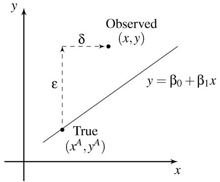

<script src="https://ajax.googleapis.com/ajax/libs/jquery/1.12.2/jquery.min.js"></script>

<script>
    $(document).ready(function() {
    $('slide:not(.title-slide, .backdrop, .segue)').append('<footer></footer>');    
    $('footer').attr('url', "https://math5387.web.app");

  })
</script>


<style>
pre {
    display: block;
    font-family: monospace;
    white-space: pre;
    margin: 1em 0px;
    margin-top: 0em;
    margin-right: 0px;
    margin-bottom: -0.2em;
    margin-left: 0px;
}
footer:after {
    font-size: 12pt;
    content: attr(url);
    position: absolute;
    bottom: 5px;
    right: 60px;
    line-height: 1.9;
    display: block;
  }
slides > slide {
  font-family: 'Open Sans', Arial, sans-serif;
  font-size: 26px;
  color: black;
  width: 900px;
  height: 700px;
  margin-left: -450px;
  margin-top: -350px;
  padding: 0px 60px;
  -webkit-border-radius: 5px;
  -moz-border-radius: 5px;
  -ms-border-radius: 5px;
  -o-border-radius: 5px;
  border-radius: 5px;
  -webkit-transition: all 0.6s ease-in-out;
  -moz-transition: all 0.6s ease-in-out;
  -o-transition: all 0.6s ease-in-out;
  transition: all 0.6s ease-in-out;
}
slides > slide > hgroup + article {
  margin-top: 5px;
}
</style>

```{r setup, include=FALSE}
knitr::opts_chunk$set(fig.align = 'center')
library(faraway)
library(corrplot)
library(perturb)
library(tidyverse)
library(kableExtra)

```

## Errors in the Predictors

Our standard regression model allows for errors in the response by including the $\epsilon$ term, but what if the predictors are measured with error?

*	i.e., What if the observed $X$ is not the one used to generate $Y$?
*	e.g., what if the predictor were the amount of exposure to secondhand tobacco smoke?  This would be very difficult to measure.

We (generally) don’t want to treat X as a random variable.

*	This is possible for observational data, but not experimental.
*	Regression inference proceeds on a fixed value of X (though we may not be able to measure X accurately).

## Account for errors in predictors

Suppose that we observe $(x_i^o,y_i^o)$ for $i=1,2,\dots,n$, which are related to the true values $(x_i^a,y_i^a)$:

$$y_i^o=y_i^a+\epsilon_i$$
$$x_i^o=x_i^a+\delta_i$$

where the errors $\epsilon$ and $\delta$ are independent.  

## In graphics


<p align="center">
  
</p>


## Problems

The true underlying relationship is 

$$y_i^a=\beta_0+\beta_1 x_i^a,$$

but we only see $(x_i^o,y_i^o)$.  They are related though the equation:

$$y_i^o=beta_0+\beta_1 x_i^o+(\epsilon_i-\beta_1 \delta_i ).$$

Assume that $E(\epsilon)=E(\delta)=0$ and $var(\epsilon)=\sigma_\epsilon^2 I and var(δ)=\sigma_\delta^2 I$.  Define

$$\sigma_x^2=\frac{\sum(x_i^a-\overline{x^a})^2}{n},\quad \sigma_{x\delta}=cov(x^a,\delta).$$

## Problems

For observational data, $\sigma_x^2$ is (essentially) the sample variance of $X^a$, while for a controlled experiment, it is just a numerical measure of the spread of the design.

We can often assume $cov(x^a,\delta)=0$.

The least squares estimator of $\beta_1$ is 

$$\hat{\beta}_1=\frac{\sum(x_i-\overline{x}) y_i}{\sum(x_i-\overline{x})^2 },$$

and we can derive that 

$$E(\hat{\beta}_1 )=\beta_1  \frac{\sigma_x^2+\sigma_{x\delta}}{\sigma_x^2+\sigma_\delta^2+2\sigma_{x\delta}}.$$

## Special case I


If there is no relation between $X^a$ and $\delta$, then $\sigma_{x\delta}=0$, and the expected value simplifies to 

$$E(\hat{\beta}_1 )=β_1 \frac{1}{1+ \sigma_\delta^2/\sigma_x^2}.$$

*	In this case, the estimate will be biased toward zero, though this won’t be a problem as long as $σ_δ^2\ll \sigma_x^2$.
*	We typically see the same pattern for multiple predictors.

## Special case II

In controlled experiments, there are two ways in which errors may arise.

*	In the first case, we measure $x$, but instead of observing $x^a$, we observe $x^o$.  If we measure $x$ again, we will get a different $x^o$.

*	In the second case, we fix $x^o$ (e.g., we make a chemical solution with concentration $x^o$).  However, the true concentration would be $x^a$.  If we repeated this process, we would get the same $x^o$ but a different $x^a$ (since we are trying to make the solution at the same concentration).

    -	In this case, $\sigma_{xδ}=cov(X^o-\delta,\delta)=-\sigma_\delta^2$, and we would have that $E(\hat{\beta}_1 )=\beta_1$.

    -	This case essentially reverses the role of $x^a$ and $x^o$, and if you get to observe the true $X$, then you will get an unbiased estimate of $\beta_1$.

## Solution

When the error in $X$ cannot be ignored, we should consider alternatives to the least squares estimation of $\beta$.

*	Two possibilities are to consider the geometric mean functional relationship or the SIMEX method.
*	Read the book for more details.


## Change of Scale

Suppose we want to change the scale of the variables, e.g.,  $x_i <- (x_i+a)/b$.

*	This may result in the estimated regression coefficient having a better scale (e.g., $\hat{\beta}_1=3.51\  vs\  \hat{\beta}_1=0.00000351$).
*	This may enhance numerical stability (really large or small values can cause problems).

Rescaling $x_i$ leaves the $t$- and $F$-tests unchanged, as well as $\hat{\sigma}^2$ and $R^2$ unchanged. $\hat{\beta}_i\to b\hat{\beta}_i$.

Rescaling $y$ leaves the $t$- and $F$-tests unchanged, and $R^2$ unchanged. $\hat{\sigma}^2$ and $\hat{\beta}$ will be multiplied by $b$.

## Savings Example

The `savings` data has data related to 50 savings-related variables in 50 countries, averaged over the period 1960-1970.  The data has the following variables:

*	`sr` - savings rate.  Personal saving divided by disposable income
*	`pop15` - percent population under age of 15
*	`pop75` - percent population over age of 75
*	`dpi`  - per-capita disposable income in dollars
*	`ddpi` - percent growth rate of dpi

Consider the changes in the regression models when we rescale the `dpi` predictor by 1000.  What changes and what doesn’t?  What if we rescaled the response (multiplying by 1000)?

## Model fit 

```{r}
lm1 <- lm(sr ~ pop15 + pop75 + dpi + ddpi, data = savings)
sumary(lm1)
```

## Model fit after scaling dpi by 1000:

```{r}
lm2 <- lm(sr ~ pop15 + pop75 + I(dpi/1000) + ddpi, data = savings)
sumary(lm2)
```

## Model after scaling response by 1000:

```{r}
lm3 <- lm(I(sr*1000) ~ pop15 + pop75 + dpi + ddpi, data = savings)
sumary(lm3)
```

## Scaling 

A very thorough approach to scaling is to convert all variables to standard units (mean 0 and variance 1) using the `scale` function.

*	The fitted line will have an intercept of 0. 
*	Advantages:  
    -	All the predictors are on a comparable scale, making comparisons simpler.
    -	The coefficients can be viewed as a kind of partial correlation (the values are always between -1 and 1).
    -	We avoid numerical problems that arise when predictors are on very different scales.
* Disadvantages:
    -	The regression coefficients represent the effect of a one standard deviation increase in the predictor on the response in standard deviations.
    -	This is not usually easy to interpret.
    
## Savings example

```{r}
scsavings <- data.frame(scale(savings))
lm4 <- lm(sr ~ pop15 + pop75 + dpi + ddpi, data = scsavings)
sumary(lm4)
```

## Plot of estimates

```{r}
edf <- data.frame(coef(lm4),confint(lm4))[-1,]
names(edf) <- c('Estimate','lb','ub')
library(ggplot2)
p <- ggplot(aes(y=Estimate,ymin=lb,ymax=ub,x=row.names(edf)),data=edf) + geom_pointrange()
p + coord_flip() + xlab("Predictor") + geom_hline(yintercept=0, col=gray(0.75)) + theme_bw()
```

## Scaling Binary Variables

Scaling might be done differently when there are binary regressors.  

*	A binary variable that takes the values 0/1 with probability half will have a standard deviation of 0.5.  
*	Moving the binary variable from 0 to 1 means moving 2 SDs.

This suggests scaling the other continuous regressors by 2 SDs rather than 1 so that interpretations are on a common scale (1 unit increase = 2 SD increase)

## Savings example


Recall that the data clusters based on the pop15 predictor.

-	We divide pop15 at 35%, so that the younger countries are coded as zero and the older countries as one.
```{r}
savings$age <- ifelse(savings$pop15 > 35, 0, 1)
savings$dpis <- (savings$dpi-mean(savings$dpi))/(2*sd(savings$dpi))
savings$ddpis <- (savings$ddpi - mean(savings$ddpi))/(2*sd(savings$ddpi))
sumary(lm(sr ~ age + dpis + ddpis, savings))
```

## Interpretation

The predicted savings rate is about 5.3% higher for countries with a younger population.

The same change of two standard deviations in ddpi means a difference of one in the new scale of ddpis.

Recall: ddpi is the percent growth rate of dpi. 
A typical country with a growth rate of dpi two standard deviation more than another typical country has a savings rate 2.47% higher. 

Another way to achieve a similar effect is to use a −1/+1 coding rather than 0/1 so that the standard scaling can be used on the continuous predictors.


## Collinearity

When the columns of $X$ are linearly dependent, then $X^T X$ is singular and there is no unique least squares estimate of $\beta$.

*	The columns of $X$ are said to be exactly collinear in this case.
*	This causes serious problems with estimation and interpretation.

Even when the columns of $X$ are not perfectly dependent, we still have problems.

## What it does

Collinearity leads to imprecise estimates of $\beta$. 

*	The signs of the coefficients can be the opposite of what intuition about the effect of the predictors might suggest.
*	The standard errors become inflated so it may be difficult to detect significant regression coefficients.
*	The fit becomes very sensitive to measurement errors.
    -	Small changes in y can lead to large changes in $\hat{\beta}$.

# Detect Collinearity

## Pairwise correlation


Examine the pairwise correlation matrix of the regressors and look for large pairwise correlations.

*	Large is a bit subjective, but the larger the correlation among regressors, the more likely it is that you have a collinearity problem.

## Coefficient of determination among regressors

Let $R_j^2$ denote the coefficient of determination when regressing $x_j$ on all other regressors.  

*	Repeat for all regressors.  

$R_j^2$ close to one indicates a collinearity problem.  

The offending linear combination can be discovered by examining the regression coefficients from each of these fits (which ones are significant?).


## Difficulties 

Collinearity makes some of the parameters difficult to estimate precisely.

Define $S_j^2$ to be the sample variance of regressor $j$.  We can show that

$$var(\hat{\beta}_j)=\sigma^2 \frac{1}{1-R_j^2}\frac{1}{(n-1) S_j^2}.$$

## Two facts

*	If $x_j$ does not vary much, then the variance of $\hat{\beta}_j$ will be large (since $S_j^2$ will be small).

```{r}
x1<-runif(100,0.4,0.5)
x2<-runif(100,0,1)
y1<-2*x1 + rnorm(100, 0, 0.5)
y2<-2*x2 + rnorm(100, 0, 0.5)
summary(lm(y1~x1))$coefficients
summary(lm(y2~x2))$coefficients
```
## Two facts

* We can maximize $S_j^2$ by spreading X as much as possible.
    -	Placing half of the points at the minimum practical value and half at the maximum maximizes this.
    
      -	This design assumes linearity and makes it impossible to check for curvature.
      -	Generally, we distribute values a bit more than this.
      
*	We can use this fact to choose experimental designs that minimize the variance of the estimated regression coefficients.  
    -	Orthogonality implies that $R_j^2=0$, which minimizes the variance.
    
## Variance Inflation Factor

If $R_j^2$ is close to 1, then the variance inflation factor

$$VIF_j=\frac{1}{1-R_j^2 }$$
will be large.

$VIF_j$ more than 5 or 10 indicates a potential problem with collinearity for regressor $x_j$.


## VIF

The VIF is the standard diagnostic for assessing collinearity.

The VIF is not appropriate for assessing collinearity for sets of related regressors like dummy-variable regressors or polynomial regressors.

The generalized VIF should be used in those cases.

For the model $Y = \beta_0 + X_c\beta_c + X_r\beta_r + \epsilon$, 

$$GVIF_c = \frac{\det(R_{c})\det(R_{r})}{\det (R)}$$
where $R_c, R_r$, and $R$ represent correlation matrix for $X_c, X_r$ and $X$.

*	The vif function in the car package automatically computes the generalized VIF for related regressors. 


## Condition number

Examine the eigenvalues of $X^T X$ (usually after scaling the predictors so they have a standard deviation of 1). Let $\lambda_1≥\lambda_2≥\dots ≥\lambda_p\geq 0$ be the eigenvalues of the $p$ regressors ordered from largest to smallest.

*	When the condition number $\kappa=\sqrt{\lambda_1/\lambda_{p} }\geq 30$ then there is a potential problem with collinearity.

*	The other condition indices are $\sqrt{\lambda_1/\lambda_i} are worth examining, because they may indicate a problem with more than one linear combination of the regressors.


## Variance Decomposition Proportions

Variance decomposition proportions can be examined to determine the regressors that are leading to large condition indices.

*	This information is provided by the colldiag function in the perturb package.
*	A variable is involved in the linear dependency if the sum of its proportions over the rows with large condition indices is more than 0.5.


## Belsley (1991)

Belsley (1991)  recommends that when using condition indices to assess collinearity that:

*	The intercept be included in your X matrix
*	The columns of X should NOT be centered.
*	The columns of X should be scaled (i.e., the standard deviation of each column should be constant).


Belsley, D.A. Computer Science in Economics and Management (1991) 4: 33. https://doi.org/10.1007/BF00426854


## Driving Example:  

Car drivers like to adjust the seat position for their own comfort. Car designers would find it helpful to know where different drivers will position the seat depending on their size and age. Researchers at the HuMoSim laboratory at the University of Michigan collected data on 38 drivers. They measured age in years, weight in pounds, height with shoes and without shoes in cm, seated height arm length, thigh length, lower leg length and `hipcenter` the horizontal distance of the midpoint of the hips from a fixed location in the car in mm.

## Fit a model with all predictors 

```{r}
lm1 <- lm(hipcenter ~ ., data = seatpos)
sumary(lm1)
```

## What we get?

Notice that the $R^2$ value is large (the model seems to fit the data fairly closely) but none of the individual predictors are significant!

This is a sign of a problem with collinearity.


## Pairwize correlations

```{r}
corrplot::corrplot.mixed(cor(seatpos))
```


There are several large pairwise correlations between predictors and between predictors and the response. 


## VIF

```{r}
vif(lm1)
```

There is a lot of variance inflation.

*	We can interpret √307.4=17.5 as meaning that the standard error for height with shoes is 17.5 times larger than it would have been without collinearity.
    -	This interpretation is not completely perfect since this is observational data and we cannot make orthogonal predictors.
    

## Condition indices 

```{r echo=F, results='asis'}
print_colldiag <- function(lm){
vdp = colldiag(lm)
vdp = round(data.frame(cbind(vdp$condindx, vdp$pi)),3)

vdp_c = lapply(vdp[-1], function(x){
  cell_spec(x, bold=T, color = ifelse(x>0.5, "red",'black'),
            font_size = spec_font_size(x))
})
vdp_c = data.frame(vdp_c)
vdp_c$cond.index = cell_spec(vdp$cond.index, font_size = spec_font_size(0.5))
kable(vdp_c, escape = F, align = 'c')%>%
  kable_styling(bootstrap_options = 'striped')
}
print_colldiag(lm1)
```
Several condition indices are large.

*	There are problems with more than one linear combination of predictors.

## Add more noice 

If we add a little bit of measurement error to the response, we get a large change in the estimated regression coefficients.


```{r}
lm2 <- lm(hipcenter + 10 * rnorm(38) ~ ., data = seatpos)
sumary(lm2)
```

## Compare

```{r echo=F}
dat = round(data.frame(Model1 = coef(lm1), Model2 = coef(lm2)),3)
kable(dat)%>%
  kable_styling(bootstrap_options = "striped")
```

The $R^2$ and standard error are very similar to the previous fit, but the coefficients have changed dramatically!

*	The coefficients are quite sensitive to collinearity.


    
## Solution 

*	Amputating regressors collinear with other regressors. 
    -	Too many regressors are trying to do the same job, so we should remove some of them.
*	Centering the regressors (subtracting their mean)
*	Scaling the regressors (dividing by their standard deviation).
*	Standardizing regressors.
*	Combining the collinear regressors into a single regressor.

## Drawbacks

*	Removing a regressor from the model that has a non-zero coefficient will result in a biased fitted model.

*The intercept column of X becomes orthogonal to the other regressors if the other regressors are centered.
    -	In that case, the interpretation of the intercept becomes that it is the mean response when the regressors are at their sample mean values.

* Centering a predictor BEFORE using it to construct polynomial terms can help mitigate problems with collinearity among the polynomial terms, but will not remove all problems. 

## Summary

*	Identify regressors with high pairwise correlation.  Only keep one of the regressors.
*	Remove regressors with large variance inflation factors since they have a strong linear relationship with others regressors.
*	Look at the variance decomposition proportions and, for rows with large condition indices, identify the regressors that have a total proportion of 0.5 or more when added together across rows.

## Example

```{r}
print_colldiag(lm1)
```

Notice that `Ht` and `HtShoes` have very large variance decomposition proportions for the largest condition index.  

Iteratively remove regressors and recompute condition indices until the problem is fixed. 

## Remove `HtShoes`

```{r}
lm2 = update(lm1, .~.-HtShoes)
print_colldiag(lm2)
```

## Remove `Seated`
```{r}
lm3 = update(lm2, .~.-Seated)
print_colldiag(lm3)
```

## Remove `Arm`

```{r}
lm4 = update(lm3, .~.-Arm)
print_colldiag(lm4)
```

## Remove `Leg`

```{r}
lm5 = update(lm4, .~.-Leg)
print_colldiag(lm5)
```


## Remove `Weight`

```{r}
lm6 = update(lm5, .~.-Weight)
print_colldiag(lm6)
```


```{r}
lm7 = update(lm6, .~.-Thigh)
print_colldiag(lm7)
sumary(lm7)
```


## Conclusion

If all the variables must be kept in the model, an alternative regression procedure such as ridge regression may be more appropriate.

The effect of collinearity on prediction depends on where the prediction is to be made.

*	The greater the distance is from the observed data, the more unstable the prediction. 
*	Distance needs to be considered in a Mahalanobis (accounting for the correlation between predictors) rather than a Euclidean sense.

## Conclusion

Note:  You really should assess collinearity right after exploratory data analysis and before variable selection.

If your regressors are collinear, then all the subsequent inference is suspect and none of the diagnostics require you to fit a model first.

It is better to remove collinear variables first, then proceed with analysis.  


