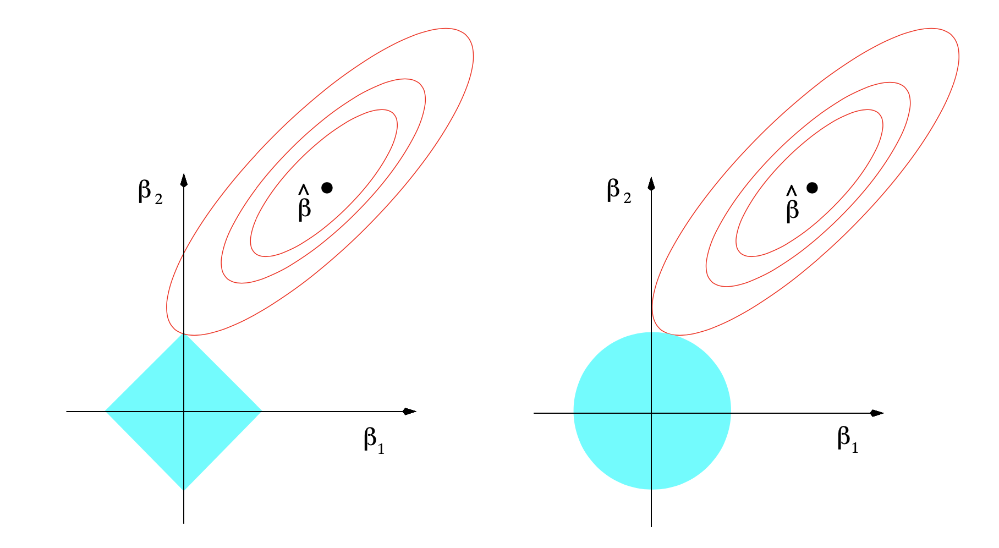

<script src="https://ajax.googleapis.com/ajax/libs/jquery/1.12.2/jquery.min.js"></script>

<script>
    $(document).ready(function() {
    $('slide:not(.title-slide, .backdrop, .segue)').append('<footer></footer>');    
    $('footer').attr('url', "https://math5387.web.app");

  })
</script>


<style>
pre {
    display: block;
    font-family: monospace;
    white-space: pre;
    margin: 1em 0px;
    margin-top: 0em;
    margin-right: 0px;
    margin-bottom: -0.2em;
    margin-left: 0px;
}
footer:after {
    font-size: 12pt;
    content: attr(url);
    position: absolute;
    bottom: 5px;
    right: 60px;
    line-height: 1.9;
    display: block;
  }
slides > slide {
  font-family: 'Open Sans', Arial, sans-serif;
  font-size: 26px;
  color: black;
  width: 900px;
  height: 700px;
  margin-left: -450px;
  margin-top: -350px;
  padding: 0px 60px;
  -webkit-border-radius: 5px;
  -moz-border-radius: 5px;
  -ms-border-radius: 5px;
  -o-border-radius: 5px;
  border-radius: 5px;
  -webkit-transition: all 0.6s ease-in-out;
  -moz-transition: all 0.6s ease-in-out;
  -o-transition: all 0.6s ease-in-out;
  transition: all 0.6s ease-in-out;
}
slides > slide > hgroup + article {
  margin-top: 5px;
}
</style>

```{r setup, include=FALSE}
knitr::opts_chunk$set(fig.align = 'center')
library(faraway)
library(corrplot)
library(perturb)
library(tidyverse)
library(kableExtra)
library(rgl)
library(knitr)
knitr::knit_hooks$set(webgl = hook_webgl)
```

# Variable Selection 

## Summary 

* Forward- and backward-stepwise selection
* Different selection criteria:
    - Adjusted $R^2$
    - AIC
    - BIC 
    - Mallow's $C_p$
    
* Training and Test error on prediction
    - Cross-validation
    
## What missed 

```{r simu1,webgl = T}
set.seed(105)
x<-runif(100)
y<-x + rnorm(100, mean = 0, sd = 0.05)
z<- 1+2*x - 3*y + rnorm(100,mean = 0, sd = 1)
plot3d(x,y,z)
cor(x,y)
```


## Individual predictors

```{r}
summary(lm(z~x))
```

## Individual predictors

```{r}
summary(lm(z~I(x+y)))
```

# Principal Component

## Principal Component in 2D

```{r}
set.seed(105)
x<-runif(100)
y<-x + rnorm(100, mean = 0, sd = 0.2)
plot(x,y, xlim = c(-0.3, 1.3), ylim = c(-0.3, 1.3), asp = 1)
```

## Principal Component in 2D

```{r}
set.seed(105)
x<-runif(100)
y<-x + rnorm(100, mean = 0, sd = 0.2)
plot(x,y, xlim = c(-0.3, 1.3), ylim = c(-0.3, 1.3), asp = 1)
pcs = prcomp(data.frame(x=x,y=y))
slope = pcs$rotation[2,]/pcs$rotation[1,]
abline(coef = c(pcs$center[2] - slope[1]*pcs$center[1], slope[1]), col = 'red')
abline(coef = c(pcs$center[2] - slope[2]*pcs$center[1], slope[2]), col = 'blue')
```


## Principal Component in R
Consider the dimensions of the human body as measured in a study on 252 men as described in Johnson (1996)

```{r}
data(fat,package="faraway")
par(mfrow = c(1,3))
plot(neck ~ knee, fat) 
plot(chest ~ thigh, fat)
plot(hip ~ wrist, fat)
```

## Principal Componenet in R

```{r}
cfat <- fat[,9:18]
prfat <- prcomp(cfat) 
dim(prfat$rot)
dim(prfat$x)
summary(prfat)
```

## Rotation Matrix

```{r}
round(prfat$rotation[,1:3],2)
```


## Principal component in R (Scaling)

```{r}

prfatc <- prcomp(cfat, scale=TRUE)
summary(prfatc)
round(prfatc$rot[,1],2)
```

## Principal Component in Math

* $X$ be $n\times p$ matrix of data points
* We seek for linear combination $\sum_{j=1}^p a_jx_j = Xa$ so that $Xa$ has maximum variance
* $var(Xa) = a^TSa$, where $S$ is the sample covariance matrix
* We seek for $a$ that maximizes $a^TSa$. 
* Need $a^Ta=1$ condition for identifiability
* Lagrange multiplier: $a^TSa - \lambda(a^Ta-1)$
* Setting first derivative equals zero $\Rightarrow$ $Sa=\lambda a$


## Some limitations

* Sensitive to outliers
    - Mahalanobis distance
        - $\sqrt{(x-\mu)^T\Sigma^{-1}(x-\mu)}$
```{r echo=F}
include_graphics('images/pca_limitations.png', dpi = 250)
```

## Many different applications

```{r echo=F}
include_graphics('images/pca_genetics.png', dpi = 150)
```

# Principal Component Regression

## Body measure example

Response: percentage of body fat

```{r}
lmoda <- lm(fat$brozek ~ ., data=cfat)
sumary(lmoda)
```

## Body measure example

```{r}
lmodpcr <- lm(fat$brozek ~ prfatc$x[,1:2])
sumary(lmodpcr)
```

## Body measure example

```{r}
round(prfatc$rotation[,1:2],2)
```

PC1: overall size
PC2: center measures 

## Scree plot 

```{r}
screeplot(prfatc, type = 'line')
abline(h=1, col='red')
```

## Scree plot 

```{r}
screeplot(prfat, type = 'line')
abline(h=1, col ='red')
```


# Regularization 

## Penalizing $\beta$

```{r}
x = seq(1,10,length.out = 100)
y = 2+2*x + rnorm(100,0,0.5)
sumary(lm(y~x))
```
## Penalizing $\beta$

```{r}
x1 = x +runif(100,0,0.1)
sumary(lm(y ~ x + x1))
```

## Penalizing $\beta$

```{r}
x2 = x + x1 +runif(100,0,0.01)
sumary(lm(y ~ x + x1+x2))
```


## Ridge Regression 

Minimize 

$$(y-X\beta)^T(y-X\beta) + \lambda \sum\limits_j\beta_j^2$$
* $\lambda\geq 0$ : complexity parameter

* The larger the $\lambda$, the grater the amount of shrinkage

RSS

$$(y-X\beta)^T(y-X\beta) + \lambda \beta^T\beta$$

Estimate 
$$\hat{\beta}_\text{ridge} = (X^TX +\lambda I)^{-1}X^Ty$$


## Properties 

$$\hat{\beta}_\text{ridge} = (X^TX +\lambda I)^{-1}X^Ty$$
* Even if $X^X$ is not of full rank, $X^TX+\lambda I$ is non-singular

* If predictors are orthonormal $\hat{\beta}_\text{ridge} = \hat{\beta}/(1-\lambda)$


## Properties

Fitted values 
Let, $X=UDV^T$

* OLS
$$X\hat{\beta} = X(X^TX)^{-1}X^Ty = UU^Ty$$

* Ridge

$$X(X^TX+\lambda I)^{-1}X^Ty = \sum\limits_{j=1}^p u_j \frac{d_j^2}{d_j^2+\lambda} u_j^Ty$$

* Since $\lambda\geq 0,$ $\frac{d_j^2}{d_j^2+\lambda}\leq 1$
* A grater amount of shrinkage is applied to the coordinates of basis vectors with smaller $d_j^2$
* $d_j^2$ are the eigenvalues of $X^TX$

# Lasso Rigression

## L1 Penalty

$$(y-X\beta)^T(y-X\beta) + \lambda \sum\limits_j |\beta_j|$$
* No closed form solution

## Compare

```{r}

```

# Penalized Regression in R

## Package `glmnet` (Ridge)

$$(1-\alpha)/2||\beta||_2^2 + \alpha ||\beta||_1$$

```{r}
library(glmnet)
load("./data/QuickStartExample.RData")
fit1 = glmnet(x,y, alpha = 0)
plot(fit1)
```


## Package `glmnet` (Lasso)

$$(1-\alpha)/2||\beta||_2^2 + \alpha ||\beta||_1$$

```{r}
fit2 = glmnet(x,y, alpha = 1)
plot(fit2)
```

## Summary

```{r}
print(fit2)
```

## Coefficients

```{r}
coef(fit2, s=0.1)
```

## Prediction 

```{r}
nx = matrix(rnorm(10*20),10,20)
predict(fit2,newx=nx,s=c(0.1,0.05))
```

## Determine $\lambda$

```{r}
cvfit = cv.glmnet(x, y, alpha = 1)
plot(cvfit)
```

## Selected $\lambda$

Value of $\lambda$ that gives minimum mean cross-validated error
```{r}
cvfit$lambda.min
```

Value of $\lambda$ that gives the most regularized model such that error is within one standard error of the minimum.

```{r}
cvfit$lambda.1se
```

## More details

* Friedman, J., Hastie, T., & Tibshirani, R. (2001). The elements of statistical learning (Vol. 1, No. 10). New York: Springer series in statistics.

* https://web.stanford.edu/~hastie/glmnet/glmnet_alpha.html
