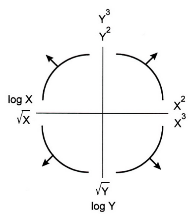

<script src="https://ajax.googleapis.com/ajax/libs/jquery/1.12.2/jquery.min.js"></script>

<script>
    $(document).ready(function() {
    $('slide:not(.title-slide, .backdrop, .segue)').append('<footer></footer>');    
    $('footer').attr('url', "https://math5387.web.app");

  })
</script>


<style>
pre {
    display: block;
    font-family: monospace;
    white-space: pre;
    margin: 1em 0px;
    margin-top: 0em;
    margin-right: 0px;
    margin-bottom: -0.2em;
    margin-left: 0px;
}
footer:after {
    font-size: 12pt;
    content: attr(url);
    position: absolute;
    bottom: 5px;
    right: 60px;
    line-height: 1.9;
    display: block;
  }
slides > slide {
  font-family: 'Open Sans', Arial, sans-serif;
  font-size: 26px;
  color: black;
  width: 900px;
  height: 700px;
  margin-left: -450px;
  margin-top: -350px;
  padding: 0px 60px;
  -webkit-border-radius: 5px;
  -moz-border-radius: 5px;
  -ms-border-radius: 5px;
  -o-border-radius: 5px;
  border-radius: 5px;
  -webkit-transition: all 0.6s ease-in-out;
  -moz-transition: all 0.6s ease-in-out;
  -o-transition: all 0.6s ease-in-out;
  transition: all 0.6s ease-in-out;
}
slides > slide > hgroup + article {
  margin-top: 5px;
}
</style>

```{r setup, include=FALSE}
knitr::opts_chunk$set(fig.align = 'center')

```


# Motivation

## Regression Diagnostics

Estimation and inference for a regression model depend on several assumptions.

These assumptions must be checked using regression diagnostics. 


## Assumptions

There are three main categories of linear regression assumptions:

**Model:**  The structural (mean) part of the model is correct, i.e., $E(y)=X\beta$.

**Error:**  $\epsilon\sim N(0,\sigma^2 I)$, i.e., that the errors are normally distributed, independent, and identically distributed with mean 0 and variance $\sigma^2$.

**Unusual observations:** All observations are equally reliable and have approximately equal role in determining the regression results and in influencing conclusions.

## Diagnostics

Diagnostics techniques may be:

-	Graphical
  -	More flexible, but require interpretation
-	Numerical
  -	Narrower in scope, but easier to interpret

Regression diagnostics often suggest improvements, causing you to fit another model, do more diagnostics, etc.  

Model building is an iterative process!

At this time, we will only concern ourselves with checking model structure, which is the most important assumption.

Note: most of the functions we will use are in the car package.

# Model Specification Diagnostics

## Residual Plots

If the linear model is correctly specified, then $cor(\hat{\epsilon},\hat{y})=0$ and $cor(\hat{\epsilon},x_j )=0$. 

Patterns in the plots of $\hat{\epsilon}$ versus $\hat{y}$ or $\hat{\epsilon}$ versus $x_j$ can occur only if some of the model assumptions are violated.

These plots should be “null plots” with no systematic features.

-	The conditional mean of the residuals should not change with the fitted values or the regressors.
-	There shouldn’t be any systematic curves or patterns.
- The residuals should be symmetrically scattered around a horizontal line at $\hat{\epsilon}=0$.

## Hypothesis Tests

A **lack-of-fit** test can be used to examine a plot of the residuals versus the regressors.  
	
-	This is simply a test of whether the squared regressor is significant when added to the original fitted model.

**Tukey’s test for nonadditivity** can be used to examine the plot of the residuals versus fitted values.
	
-	This is simply a test of whether the square of $\hat{y}$ is significant when added to the original fitted model.

If either of these tests are significant, it suggests there is unaccounted curvature in the data that is not captured by the fitted model.

The `residualPlots` function can be used to easily produce these residual plots and perform the associated tests.

## Example

We examine the relationship between occupational “prestige” and various predictors among Canadians.  

The data include the variables:

-	`education` - Average education of occupational incumbents, years, in 1971.
-	`income` - Average income of incumbents, dollars, in 1971.
-	`women` - Percentage of incumbents who are women.
-	`prestige` - Pineo-Porter prestige score for occupation, from a social survey conducted in the mid-1960s.
-	`census` - Canadian Census occupational code.
-	`type` - Type of occupation. A factor variable with levels (note: out of order): `bc`, Blue Collar; `prof`, Professional, Managerial, and Technical; `wc`, White Collar.

## Residual Plot `prestige ~ education + income + type`

```{r}
data(Prestige, package = 'carData')
lmod = lm(prestige ~ education + income + type, data = Prestige)
car::residualPlots(lmod)
```

## Tests `prestige ~ education + income + type`

```{r}
data(Prestige, package = 'carData')
lmod = lm(prestige ~ education + income + type, data = Prestige)
knitr::kable(car::residualPlots(lmod, plot = F, test = F))
```

## How the tests work

```{r}
lmod = lm(prestige ~ education + income +I(income^2) + type , data = Prestige)
summary(lmod)
```

## How the tests work
```{r}

lmod = lm(prestige ~ education + income  + type , data = Prestige)
Prestige_new <- cbind(na.omit(Prestige), data.frame(fitted = lmod$fitted.values))
lmod1 = lm(prestige ~ education + income  + type + I(fitted^2) , data = Prestige_new)
summary(lmod1)$coefficients
pnorm(summary(lmod1)$coefficients[6,3])
```

## What we get

The education variable shows no systematic patterns.

## What we get

The education variable shows no systematic patterns.

The income variable has a somewhat non-linear pattern, which is confirmed by the lack-of-fit test.

## What we get

The education variable shows no systematic patterns.

The income variable has a somewhat non-linear pattern, which is confirmed by the lack-of-fit test.

The type variable shows no clear systematic pattern (prof has a median slightly above 0, but that can certainly happen due to sampling variation).

## What we get

The education variable shows no systematic patterns.

The income variable has a somewhat non-linear pattern, which is confirmed by the lack-of-fit test.

The type variable shows no clear systematic pattern (prof has a median slightly above 0, but that can certainly happen due to sampling variation).

There is clear non-linearity in the plot of the residuals versus fitted values, as confirmed Tukey’s test for nonadditivity.


## Limitation of Residual Plot

Residual plots can detect nonlinearity, but they cannot be used to determine whether the nonlinearity is monotonic (think a log relationship) or non-monotonic (think a quadratic relationship).

Consider two data sets, A and B.  Fit the following models to the data sets:

A: $y=\beta_0+\beta_1 \sqrt{x}+\epsilon$

B: $y=\beta_0+\beta_1 x+\beta_2 x^2+\epsilon$


## Limitation of Residual Plot

```{r, echo=F, fig.height=5}
knitr::include_graphics('images/residual_diag.png', dpi = 100)
```

Surprisingly, the residual plots for the two fitted models (the lower panels) are identical, even though data set A needed a monotonic transformation (log) of x, while data set B required a non-monotonic (quadratic) transformation of x.


# Marginal Model Plots

## Marginal Model Plots

The marginal model plot compares the marginal relationship between the response and each regressor.

This plot consists of:
	
1. The plot of $y$ vs $x_j$ for each quantitative, non-interactive regressor.
2. A nonparametric, smoothed line of $\hat{y}$ versus $x_j$.  Call this the “model” line.
3. A nonparametric, smoothed line of $y$ versus $x_j$.  Call this the “data” line.

The `car` package uses the `loess` smoother.

## How to use?

For a non-problematic fitted model:

-	The model and data lines should be similar.  
-	The lines should follow the pattern of the data.

For genuine, real-life, noisy data, it is possible neither line fits the data very well, but they should match any obvious structural patterns.

The `marginalModelPlots` function generates these graphs.

Note: not seeing a problem does NOT indicate we have a good model, only that there are no apparent problems.

## Example: `prestige ~ education + income + type`

```{r}
car::marginalModelPlots(lmod)
```

## What we get?

The marginal model plots do not provide clear evidence of a model problem for the occupational prestige data, though the plot of $y$ versus $\hat{y}$ is suspicious.

# Added Variable Plots

## What is it?

Added variable (av) plots (or partial regression plots) help to isolate the impact of regressor $x_i$ on the response $y$, after accounting for the effect of the other regressors in the model.

-	Marginal model plots displayed the marginal relationships between the response and regressors while ignoring the other regressors in the model.

## How to Construct?

-	Regress $y$ on all regressors except $x_i$, then get the residuals, $\hat{\delta}$.

## How to Construct?

-	Regress $y$ on all regressors except $x_i$, then get the residuals, $\hat{\delta}$.
-	This represents the part of $y$ not explained by the the other regressors.
-	Regress $x_i$ on all regressors except $x_i$, then get the residuals $\hat{\gamma}$.  


## How to Construct?

-	Regress $y$ on all regressors except $x_i$, then get the residuals, $\hat{\delta}$.
-	This represents the part of $y$ not explained by the the other regressors.
-	Regress $x_i$ on all regressors except $x_i$, then get the residuals $\hat{\gamma}$.  
-	This represents the part of $x_i$ not explained by the other regressors.
-	The **added variable plot** displays $\hat{\delta}$ versus $\hat{\gamma}$.

## What it gives?

Added variable plots can identify a non-linear relationship between the response and a regressor.

-	If the data follow a clear non-linear pattern in comparison with the least-squares line, then there is a structural problem with our model.
  -	A curve in the points and a dramatic change in the structure of the points would indicate a problem with the structural component of the model.
-	The added variable plot cannot suggest a transformation because the x-axis is not the original predictor.

- The plot CAN indicate whether the transformation should be monotonic or non-monotonic.

## Some Properties

-	The OLS linear fit to the data in an added variable plot will for regressor $x_j$ will have slope $\beta_i$ and intercept 0.
-	Though scaled differently, we can still see which observations have high leverage with respect to each regressor.
-	For factor variables, an added variable plot is constructed for each contrast that is used to define the factor, so redefining the contrasts will change the added variable plots. 

The `avPlots` function can be used to generate added variable plots for a fitted model.


## What to look for?

Added variable plots can be used to assess the strength of the relationship between the response and a regressor.

-	A flat band of points around the fitted line would indicate that there is no relationship or a weak relationship between the response and regressor $x_i$, after accounting for the other regressors.

Added variable plots can be used to identify outliers and/or high leverage observations that seem to be influential in determining the estimated coefficient for $x_i$.

-	Does the OLS line follow the overall pattern of the data, or are there a few points that seem to be “pulling” the line toward them?

## Example: `prestige ~ education + income + type`

```{r}
car::avPlots(lmod)
```


# Component Plus Residual Plots

## What is it?

The **component plus residual (cr) plot**  (a.k.a, **partial residual plot**) is a competitor to the added variable plot.

The **cr plot** shows $\hat{\beta}_i x_i+\hat{\epsilon}$ versus $x_i$.

-	$\hat{\beta}_i x_i$ is the “component” for $x_i$.
-	This is motivated by the relationship
$$y - \sum\limits_{j\neq i} x_j\hat{\beta}_j = \hat{y} +\hat{\epsilon} - \sum\limits_{j\neq i} x_j\hat{\beta}_j =x_i\hat{\beta}_i+\hat{\epsilon}.$$

-	The idea is to compare the impact of the $i$th regressor on the fitted values.
-	**cr** plots are useful for checking nonlinear relationships in the variable being considered for inclusion in the model.

## What it gives?

-	They can also suggest potential transformation of the data so that the relationship is linear.
-	If the scatter plot does not appear to be linear, then there is a nonlinear relationship between the regressor and the response (after accounting for the other regressors).  
-	The slope of the line fit to the cr plot is $\hat{\beta}_i$.


## How to get it?

The `crPlots` function can be used to generate component plus residual plots for a fitted model.

-	The plot includes the OLS line for the data (with slope $\hat{\beta}_i$) and well as a the line from a nonparametric smooth.  
-	Ideally, the two lines would be similar and match the pattern of the data.
-	The nonparametric smooth makes it easier to see deficient fits.

## Example: `prestige ~ education + income + women`

```{r}
lmod = lm(prestige ~ education + income + women, data = Prestige)
car::crPlots(lmod)
```


## Simulated Example

```{r}
set.seed(10)
y<-c(1:1000)
x1<-c(1:1000)*runif(1000,min=0,max=2)
x2<-(c(1:1000)*runif(1000,min=0,max=2))^2
x3<-log(c(1:1000)*runif(1000,min=0,max=2))
dat = data.frame(y = y, x1 = x1, x2 = x2, x3 = x3)
pairs(dat)
```

## Simulated Example

```{r}
lmod1<-lm(y~.,data = dat)
car::crPlots(lmod1)
```

## Try Some Transformation

```{r}
lmod2 = lm(y ~ x1 + sqrt(x2)+exp(x3))
car::crPlots(lmod2)
```


# Transformations

## Bulging Rule

If a relationship is nonlinear but monotone and simple, Mosteller and Tukey’s bulging rule can be used to guide the selection of linearizing transformations.

Compare the graphic below with the type of “bulge” seen in your data; move along the “ladder of transformations” for your response or predictors to determine a helpful transformation.

-	Note: in multiple regression, transforming the response will impact the relationship with all of the regressors, while transforming a single regressor will have less impact on the relationship between the response and the other regressors.

## Bulging Rule 

```{r, echo=F}

```

## Correct `prestige ~ education + income + women`

Let's look at the cr Plot of the model again:

```{r}
lmod = lm(prestige ~ education + income + women, data = Prestige)
car::crPlots(lmod)
```

## Correct `prestige ~ education + income + women`

Let's look at the cr Plot of the model again:

```{r}
lmod = lm(prestige ~ education + income + women, data = Prestige)
car::crPlots(lmod)
```

The bulge suggests a log or square root transformation of income. 

## Square Root Transformation

```{r}
lmod = lm(prestige ~ education + sqrt(income) + women, data = Prestige)
car::crPlots(lmod)
```


## The `log` Transformation

```{r}
lmod = lm(prestige ~ education + log(income) + women, data = Prestige)
car::crPlots(lmod)
```


## Transformation on any other predictors?


## Transformation on any other predictors?

Adding a quadratic for women might further improve the model fit.


## Transformation on any other predictors?

Adding a quadratic for women might further improve the model fit.

Adding raw polynomials (x,x^2,x^3,…) to our model can be problematic.

-	They can induce instability in the model since they can become highly correlated.
-	It is generally recommended that one centers x (i.e., subtracts the mean) before generating the polynomials.
-	Use the poly function to generate orthogonal polynomials, which reduce the potential for model instability.

Orthogonal polynomials have the benefit that adding the higher order term doesn’t impact the estimated coefficients for the other polynomials!

## Finally 

```{r}
lmod = lm(prestige ~ education + log(income) + poly(women,2), data = Prestige)
car::crPlots(lmod)
```


## Use of **Logistic** Function

When a predictor variable is a number between 0 and 1 (or a percentage between 0 and 100), it is not uncommon to observe a **logistic** relationship between the predictor and the response (e.g, in the cr plot).  

In that case, one might transform that predictor using the `logit` function in the car package to help improve the model fit.

## Logit Function

```{r, echo=F}
x = seq(0,1,0.01)
y = car::logit(x)
plot(x,y, type = 'l')
```


# CERES Plots

## What is it?
If the relationships between the regressors are strongly nonlinear and not well described by polynomials, then component plus residuals plots may not be effective in identifying nonlinear partial relationships between the response and the regressors.  

The **CERES plot** (Combining conditional Expectations and RESiduals plots) (can) use nonparametric smoothers rather than polynomial regression to adjust for nonlinearities, so it is supposed to be a bit more robust in detecting nonlinearities.

-	The fitted line and nonparametric line should be similar and match the pattern of the data.
-	The `ceresPlots` function can be used to generate CERES plots.


## How to get it?

To construct a CERES plot (for predictor $x_1$):

Let $\hat{x}_{ij} = \hat{g}_{ij}(x_{i1})$ be the fitted value for the $i$th observation when regressing $x_j$ on $x_1$.

-	The model could be a simple linear regression, a quadratic regression, or a non-linear regression.
-	This is why the CERES plots are more flexible than the cr plots.

Estimate the coefficients of the model:

$$y = \alpha + \beta_2^{''}x_{i2}+\dots + \beta_{p-1}^{''}x_{i,p-1} + \gamma_{12}\hat{x}_{i2}+\dots +\gamma_{1,p-1}\hat{x}_{i,p-1}+\epsilon_i^{''}.$$
Plot the adjusted residuals
$$\hat{\epsilon}_i^{(1)} = \hat{\epsilon}^"_i+\hat{\gamma}_{12}\hat{x}_{12}+\dots + \hat{\gamma}_{1,p-1}\hat{x}_{1,p-1}$$

against $x_1$.


```{r}
lmod = lm(prestige ~ education + income + women, data = Prestige)
car::ceresPlots(lmod)
```


# Example

## Savings Example

The `savings` data has data related to 5 savings-related variables in 50 countries, averaged over the period 1960-1970.  The data has the following variables:

-	`sr` - savings rate.  Personal saving divided by disposable income
-	`pop15` - percent population under age of 15
-	`pop75` - percent population over age of 75
-	`dpi`  - per-capita disposable income in dollars
-	`ddpi` - percent growth rate of dpi

Assess whether there are any structural problems for the model regressing savings rate on all other variables.


## Final Note

The transformation approaches presented here are simple, and only work for data with simple non-linearaties.

Other approaches (available in the car package) are the:

-	Box-Cox transformation for the response variable
-	Box-Tidwell transformation for the predictors.

For complicated data, no simple transformation or basic linear regression may capture the relationship between the response and regressors.

# Polynomials

## Raw vs Orthogonal Polynomials

Raw polynomials can become highly correlated very quickly, leading to numerical instability.

Orthogonal polynomials deal will this by centering each polynomial and (essentially) utilizing the Q part of the QR decomposition of the centered polynomials.  (See https://stackoverflow.com/a/19484716/2993948). 


## Raw polynomials are highly correlated

```{r}
x = rnorm(50)
# generate polynomials of degree 5
xp = sapply(1:5, function(p) x^p)
# highly correlated
knitr::kable(round(cor(xp), 3))
```

## Orthogonal Polynomial

Correlation between the $Q$ matrix of the $QR$ decomposition of the centered polynomials and the results produced by the poly function:

```{r}
 # center each polynomial
 xpc = scale(xp, scale = FALSE)
 # find the Q matrix of the QR
 # decomposition of xpc
 xpoly = qr.Q(qr(xpc))
 # correlation between xpoly and poly func.
 knitr::kable(round(cor(xpoly, poly(x, 5)), 3))
```
