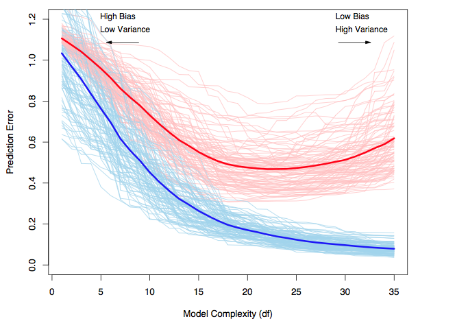

<script src="https://ajax.googleapis.com/ajax/libs/jquery/1.12.2/jquery.min.js"></script>

<script>
    $(document).ready(function() {
    $('slide:not(.title-slide, .backdrop, .segue)').append('<footer></footer>');    
    $('footer').attr('url', "https://math5387.web.app");

  })
</script>


<style>
pre {
    display: block;
    font-family: monospace;
    white-space: pre;
    margin: 1em 0px;
    margin-top: 0em;
    margin-right: 0px;
    margin-bottom: -0.2em;
    margin-left: 0px;
}
footer:after {
    font-size: 12pt;
    content: attr(url);
    position: absolute;
    bottom: 5px;
    right: 60px;
    line-height: 1.9;
    display: block;
  }
slides > slide {
  font-family: 'Open Sans', Arial, sans-serif;
  font-size: 26px;
  color: black;
  width: 900px;
  height: 700px;
  margin-left: -450px;
  margin-top: -350px;
  padding: 0px 60px;
  -webkit-border-radius: 5px;
  -moz-border-radius: 5px;
  -ms-border-radius: 5px;
  -o-border-radius: 5px;
  border-radius: 5px;
  -webkit-transition: all 0.6s ease-in-out;
  -moz-transition: all 0.6s ease-in-out;
  -o-transition: all 0.6s ease-in-out;
  transition: all 0.6s ease-in-out;
}
slides > slide > hgroup + article {
  margin-top: 5px;
}
</style>

```{r setup, include=FALSE}
knitr::opts_chunk$set(fig.align = 'center')
library(leaps)
```

## Overview

Variable selection is intended to (objectively) find the best subset of predictors.

Reasons for this include: 

*	We want the simplest model that adequately explains the data. 
*	Unnecessary regressors will add noise to all model estimates.
    -	Degrees of freedom are wasted.
    -	A smaller model might achieve more precise estimates and predictions.
*	Removing excess regressors aids in interpretation and helps to prevent problems with linearly dependent regressors. 
* If the model is to be used for prediction, we can save time and/or money by not having to measure extra predictors (and improve our prediction!).

## Two aspects to variable selection:

*	The criterion used to compare models.
*	The strategy used to search for the “optimal” model.

## Selection Criteria (P-values)

P-values are a common criterion for selecting regressors to keep in our regression model.  

This criterion keeps the regressors with the smallest p-values in the model, specifically the regressors with p-values less than some threshold, $\alpha_{crit}$.

## Selection Criteria (AIC)

*Akaike's Information Criterion* is a information-based criterion for variable selection. 

$$AIC(\mathcal{M}) = -2\ell(\mathcal{M}) + 2p_\mathcal{M}$$
where, 

* $\mathcal{M}$ is the model 
* $\ell(\mathcal{M})$ is the log likelihood of the model using the MLE estimates of the parameters
* $p_\mathcal{M}$ is the number of regression coefficients in model $\mathcal{M}$


For linear regression models, $-2\ell(\mathcal{M}) = n\log (RSS/n) + c$, where $c$ is a constant that depends only on the observed data and not on the model. $c$ can be ignored when comparing between models (on same data). 

## Selection Criteria (BIC)

*Bayesian Information Criterion* is another information-based criterion for variable selection. 

$$BIC(\mathcal{M}) = -2\ell(\mathcal{M}) + \log (n)p_{\mathcal{M}}$$
where, 

* $\mathcal{M}$ is the model 
* $\ell(\mathcal{M})$ is the log likelihood of the model using the MLE estimates of the parameters
* $p_\mathcal{M}$ is the number of regression coefficients in model $\mathcal{M}$


## Smaller AIC or BIC is better

We favor models with smaller AIC or BIC.

The information criteria capture two aspects of model fit:

*	The $-2\ell(\mathcal{M})$ measures how well the fitted model matches the observed data.
*	The second component penalizes the model according to the number of parameters it includes (its complexity).
    *	The more parameters, the larger the penalty.
*	Models with more parameters will fit better (reducing the RSS), but will be penalized more for having additional parameters.
*	AIC and BIC provide criteria for balancing model fit with model complexity.

* BIC tends to penalize complex models more heavily than AIC (anytime $\log(n)>2$, i.e., n≥8), so it tends to suggest simpler models than the AIC criterion.

## Selection Criteria ($R^2$)

$R^2$ never decreases as new regressors are added to the model.

*	It is useless for comparing models with different numbers of regressors.

*Adjusted $R^2$*, $R_a^2$, is a better criterion for assessing model fit.  
*	The adjusted $R^2$ criterion penalizes for the number of parameters in the model.

For mdoel $\mathcal{M}$ with $p_\mathcal{M}$ regression coefficients, 

$$R_a^2 = 1 - \frac{\frac{RSS_\mathcal{M}}{n-p_\mathcal{M}}}{\frac{TSS}{n-1}} = 1 - (\frac{n-1}{n-p_\mathcal{M}})(1-R^2) = 1-\frac{\hat{\sigma}^2_\mathcal{M}}{\hat{\sigma}^2_{null}}$$

*We favor models that produce larger $R_a^2$.*


## Selection Criteria (Mallow's $C_p$)

Mallow's $C_p$ statistic is a criterion designed to quantify the predictive usefulness of a model. 

At its core, Mallow's $C_p$ statistic is trying to estimate the standardized total mean square prediction error, given by

$$\frac{1}{\sigma^2} \sum\limits_i E(\hat{y}_i - E(y_i))^2 = \frac{1}{\sigma^2}\sum\limits_i MSE(\hat{y}_i)$$
For model $\mathcal{M}$ with $p_\mathcal{M}$ regression coefficients, this quantity is estimated by 

$$C_{p_\mathcal{M}} = \frac{RSS_\mathcal{M}}{\hat{\sigma}^2_\Omega} + 2p_\mathcal{M} -n$$

## Intuition behind Mallow's $C_p$

* Total error in fitted value of $i$th observation 

$$\hat{Y}_i - \mu_i$$
* Easy to show 

$$E[(\hat{Y}_i-\mu_i)^2] = (E(\hat{Y}_i) - \mu_i)^2 + Var(\hat{Y}_i$$
* The total mean squared error 

$$\sum\limits_i E[(\hat{Y}_i-\mu_i)^2] = \sum\limits_i(E(\hat{Y}_i) - \mu_i)^2 + \sum\limits_i Var(\hat{Y}_i$$

* The criterion measures 

$$\Gamma_p = \frac{1}{\sigma^2} \left[ \sum\limits_i(E(\hat{Y}_i) - \mu_i)^2 + \sum\limits_i Var(\hat{Y}_i \right]$$

* Unbiased estimate of $\Gamma_p$ is the Mallow's $C_p$. 

## Properties of Mallow's $C_p$

* For the model with all regressors (model $\Omega$ with $p_\Omega$ regression coefficients), $C_{p_\Omega} = p_\Omega$
* If a model with $p_\mathcal{M}$ regression coefficients fits the data well and has little or no bias, then $E(C_{p_\mathcal{M}}) \approx p_\mathcal{M}$
* When the $C_p$ values for all possible regression models are plotted against $p$, those models with little bias will tend to fall near the $C_p=p$ line ($p$ on the horizontal axis). 
* Models considerably above the line are biased. 
* Models bellow the line are considered unbiased and being below the line due to sampling error. 
* We favor models with small $p_\mathcal{M}$ and $C_{p_\mathcal{M}}$ close to $p_\mathcal{M}$

## selection Criteria (MSE)

The mean squared error (MSE) for prediction is simply the average of the squared deviations between the fitted values and the observed data, i.e., $\frac{1}{n}\sum (y_i-\hat{y}_i)^2$

*	We favor models with smaller mean squared error, but the search algorithm is very important, otherwise you just use the model with the most regressors.
*	The RMSE (root mean squared error) is simply the square root of the MSE, and is sometimes used in place of the MSE.
    - The RMSE or MSE will produce identical variable selection results since they are 1-1 transformations of each other.


## Training vs Test Error

Which one will be higher?


## Bias-Variance tradeoff


## Bias-Variance tradeoff



Courtesy : The Elements of Statistical Learning by Jerome H. Friedman, Robert Tibshirani, and Trevor Hastie. Blue curves show the training errors on 100 samples of size 50. Red curves are the corresponding test set errors


## Cross Validation 

Cross-validation breaks the data into a training dataset and a test dataset to get a more accurate assessment of the predictive accuracy of a model.

*	A model is fit to the training dataset and then the fitted model is used to predict the responses of the test dataset, from which an error criterion (e.g, the MSE) is calculated for the test dataset.
    -	We favor the model the minimizes the MSE (or optimizes some other measure of prediction accuracy).


## Cross Validation 

There are many variations of how to choose the training and testing datasets for crossvalidation.

*	Leave-one-out crossvalidation uses each observation (individually) as a test data set, using the other n-1 observations as the training data.
    -	In principle, we must fit n models to find the mean squared error, though this can be done using only a single model if you scale things correctly..

*	k-fold crossvalidation breaks the data into k unique sets.  
    -	For each set, the other k-1 sets are used as training data, and then the fitted model is used to predict the responses for the kth testing set.
    -	We must fit k models to determine the mean squared error.
*	There are other mechanisms for choosing the training and test datasets, but these are the most common.


## Cross Validation

When using cross-validation as your selection criterion, we prefer the model that produces the lowest MSE or RMSE.

*	You typically don’t do an exhaustive search or stepwise selection search.
*	You often use one of the other selection criteria/search strategies to narrow down the possible models to a few final candidate models and then use cross-validation to make a final decision.

# Search Strategies 

## Exhaustive Search 

An exhaustive search looks at all possible models using all available regressors.

*	This is not feasible unless the number of regressors is relatively small.  
*	If the number of regressors (including the intercept) is $p_\Omega$, there are $2^{p_\Omega}$ possible models.

Because of our error criteria, our search often simplifies to finding the model that minimizes $RSS_\mathcal{M}$ for each value of $p_\mathcal{M}$.  
-	This is the best subset searching strategy.
    -	It’s really just a smart way to do an exhaustive search.


## Stepwise 

When the previous strategies may take too long, stepwise selection can be used to iteratively build models, choosing the next model as the one that maximizes or minimizes the criterion of interest.

-	Backwards selection starts with the model having all regressors, then prunes the regressors one at a time until we can no longer improve the error criterion by removing a single regressor.
-	Forward selection starts with the null model (only an intercept), and adds regressors one at a time until we can no longer improve the error criterion by adding a single regressor.  
-	“Both” (or commonly, stepwise selection) is similar to backward selection, except that we can add a regressor back into the model if it improves the error criterion.


## Additional Notes on Model Selection

Stepwise selection can miss the optimal model because we do not consider all possible models due to the one-at-a-time nature of adding/removing regressors.

P-values should not be taken as very accurate in stepwise or best subset searches because we are bound to see small p-values due to chance alone.

Stepwise selection tends to produce simpler models that are not necessarily the best for prediction.


## Model Hierarchy

We must respect hierarchy in models when it is naturally present.

*	In polynomial models, $x^2$ is a higher order term than $x$.
*	A lower order term should be retained if a higher order term is retained to increase the flexibility.
    -	E.g., for the model $y=\beta_0+\beta_2 x^2+\epsilon$, the maximum/minimum value MUST occur at x=0.  
    -	For the model $y=\beta_0+\beta_1 x+\beta_2 x^2+\epsilon$, the maximum/minimum value can occur anywhere along the real line (depending on what the data suggest).
    - Example:  If we fit the model $y=\beta_0+\beta_1 x+\beta_2 x^2+\epsilon$ and $β\beta_1$ is not significant, it would NOT make sense to remove $x$ from the model but still keep $x^2$.

## Example 

The U.S. Bureau of the Census collected data from the 50 states in the 1970s.  Measured variables include:

*	`Population`: population estimate as of July 1, 1975
*	`Income`: per capita income (1974)
*	`Illiteracy`: illiteracy (1970, percent of population)
*	`Life.Exp`: life expectancy in years (1969–71)
*	`Murder`: murder and non-negligent manslaughter rate per 100,000 population (1976)
*	`HS Grad`: percent high-school graduates (1970)
*	`Frost`: mean number of days with minimum temperature below freezing (1931–1960) in capital or large city
*	`Area`: land area in square miles


## Backward Selection

```{r echo=F} 
library(faraway)
data(state)
statedata = as.data.frame(state.x77)
names(statedata) = gsub(' ','.', names(statedata))
lmod <- lm(Life.Exp ~ ., data = statedata)
sumary(lmod)
```

*	Higher murder rates decrease life expectancy!
*	Many variables not significant.

## Remove least significant predictor (Area):

```{r}
lmod <- update(lmod, . ~ . - Area)
sumary(lmod)
```

## Remove least significant predictor (Illiteracy)

```{r}
lmod <- update(lmod, . ~ . - Illiteracy)
sumary(lmod)
```

## Remove least significant predictor (Income)

```{r}
lmod <- update(lmod, . ~ . - Income)
sumary(lmod)
```

## Remove `Population`? 

Whether we should remove Population is a close call. We should probably keep it if it makes the model more interpretable. 

```{r}
lmod <- update(lmod, . ~ . - Population)
sumary(lmod)
```


All variables are now significant at $\alpha_{crit} = 0.05$


## How much improvement

The $R^2$ for the full model is 0.736.  Our final model has an R^2 of 0.713, which is only slightly lower.

*	Removal of four predictors causes only a minor reduction in fit. This is NOT surprising. 

* A better question might be: what would the effect of removing these variables be on a new independent sample? 


## Is it a good practice?

Eliminated variables may still be important.

*	Replacing HS.Grad with Illiteracy …

```{r}
sumary(lm(Life.Exp ~ Illiteracy + Murder + Frost, statedata))
```

*	Illiteracy does have some association with life expectancy
*	High school graduation rate and illiteracy are likely correlated 
*	Impossible to know which is the important/causal variable 
*	Both could be important or both could be proxies for a third variable.


## Example 2

Use best subset selection to minimize the AIC criterion.

*	The regsubsets function in the leaps package can be used to do this.  
*	For each number of regression coefficients p, it finds the model that minimizes the RSS.
    -	For each value of p, the model that minimizes the RSS will have the smallest AIC, BIC, R_a^2, and Mallow’s C_p.

*	NOTE: By default, regsubsets only goes up to p=9.  You have to set nvmax = j, where j is the number of regressors you want to consider.


## Example 2

```{r}
b <- leaps::regsubsets(Life.Exp ~ ., data = statedata)
rs <- summary(b)
rs$which
```

## Example 2

Plot of several selection criteria versus the best subsets are available via the subsets function in the car package.

```{r fig_bic1, results='hide', message=F, comment=F}
car::subsets(b, legend = F)
```

## Example 2 

```{r fig_aic} 
p = 2:8; pp = p-1
aic <- rs$bic + p *(2 - log(nrow(state.x77)))
plot(aic ~ pp, xlab = 'Subset Size')
```

The model with $p=5$ is best. This model includes the predictors: population, murder, high school graduation rate, and frost. 


## Example 2

```{r fig_cp, comment=F, message=F, results='hide'}
car::subsets(b, statistic = "cp", legend = FALSE)
abline(1, 1) # corresponds to 45 degree line offset by 1 unit vertically
```

## Example 2 

```{r fig_adjr2, results='hide'}
car::subsets(b, statistic = "adjr2", legend = FALSE)
```


## Stepwise with AIC 

```{r step_aic}
lmod = lm(Life.Exp ~ ., data = statedata)
step(lmod, direction = 'both')
```


```{r step_aic1}
lmod = lm(Life.Exp ~ ., data = statedata)
step_aic = step(lmod, direction = 'both', trace = F)
summary(step_aic)
```

## Example (Cross Validation)

Comparison of full model to model with Population, Murder, HS.Grad, and Frost predictors using the RMSE criterion and both 10-fold crossvalidation and leave-one-out crossvalidation.

```{r message=F, comment=F}

library(caret)
# define training/test (control) data
cv_10fold = trainControl(method = "cv", number = 10) # 10-fold crossvalidation train/test data
cv_loo = trainControl(method = "LOOCV") # leave-one-out crossvalidation train/test data
cv_loo_slow = trainControl(method = "cv", number = 50) # loo crossvalidation train/test data

# train the full model
f1 = Life.Exp ~ . # formula for full model
# formula for reduced model with p = 5
f2 = Life.Exp ~ Population + Murder + HS.Grad + Frost 
# formula for reduced model 2 with p = 4
f3 = Life.Exp ~ Murder + HS.Grad + Frost 
```

## Continue 

```{r}
# the train function needs:
# formula - to formula for the model you want to fit,
# data - the data frame where the variables are located
# trControl - the training/testing data sets created using the trainControl function
# method - the type of model you want to fit.  There are a lot of choices.  We simply need "lm"
modela = train(f1, data = statedata, trControl = cv_10fold, 
               method = "lm")
modelb = train(f2, data = statedata, trControl = cv_10fold, 
               method = "lm")
```

## Continue 

```{r}
# compare mse (rmse) for the two models using 10-fold cv
print(modela$results) # full, 10-fold
print(modelb$results) # reduced, 10-fold
```


The smaller model is preferred (since it has smaller RMSE) using 10-fold crossvalidation.

```{r}
modelc = train(f1, data = statedata, trControl = cv_loo, 
               method = "lm")
modeld = train(f2, data = statedata, trControl = cv_loo, 
               method = "lm")
# compare mse (rmse) for the two models using 10-fold cv
print(modelc$results) # full 2, LOO
print(modeld$results) # reduced 2, LOO
```

The smaller model is preferred (since it has smaller RMSE) using leave-one-out crossvalidation.


```{r}
modele = train(f2, data = statedata, trControl = cv_loo, 
               method = "lm")
modelf = train(f3, data = statedata, trControl = cv_loo, 
               method = "lm")
print(modele$results) 
print(modelf$results) 
```
## Influence of outliers

Variable selection can be affected by outliers and transformations.

Alaska is a high leverage point.  What’s the effect if we remove it?

```{r echo=F}
lmod <- lm(Life.Exp ~ ., data = statedata)
library(car)
influencePlot(lmod)
```

## Removing Alaska

```{r}
b <- regsubsets(Life.Exp ~., data = statedata, subset = (state.abb!="AK"))
rs <- summary(b)
rs$which[which.max(rs$adjr), ]
```

We now choose a 5 regressor model using R_a^2, whereas we chose 4 before.
